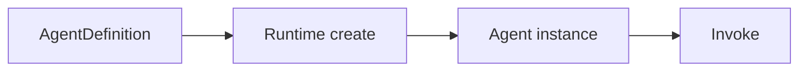
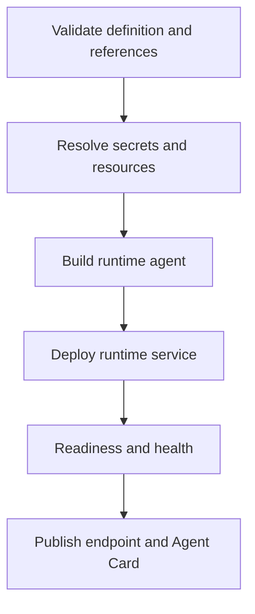

# Open Simple Agent — Project Definition

## Document purpose

This document defines the product scope, architectural boundaries, and target
capabilities of Open Simple Agent (OSA). It is normative for product direction.

Implementation status is intentionally separate: [README.md](README.md) states
what works now, [docs/ARCHITECTURE.md](docs/ARCHITECTURE.md) maps the current
code, and [TODO.md](TODO.md) lists the remaining work. A capability described as
a target here must not be presented as implemented unless those documents and
automated tests confirm it.

## Product definition

Open Simple Agent is a lightweight, configuration-driven platform for defining,
running, managing, and discovering autonomous AI agents.

An agent combines:

```text
instructions + model + tools + MCP servers + skills + memory + session
```

and executes directly through an agent runtime. OSA focuses on agents, not
workflows.

The initial runtime implementation is Google ADK. Additional runtimes are only
introduced for a concrete product requirement; behavioral equivalence across
frameworks is not a goal.

## Primary goal

A user should be able to define and operate a useful agent without writing a
business-specific agent class.

```yaml
apiVersion: osa/v1alpha1
kind: Agent
metadata:
  name: customer-support
  version: 1.0.0
spec:
  instruction: |
    Help customers resolve support requests.
    Use the available resources and do not invent customer data.
  model:
    ref: default
  mcps:
    - ref: crm
  tools:
    - calculator
  skills:
    - customer-support
  memory:
    enabled: true
    policy: user-memory
```

The definition is only one part of a runnable deployment. Referenced resources,
runtime implementations, secret resolution, and deployment configuration must
also be resolvable by the platform.

## Project independence

Open Simple Agent is a separate project with its own purpose, architecture,
runtime, roadmap, and governance. No dependency, shared architecture,
reference-implementation relationship, compatibility requirement, or
interoperability assumption is defined between OSA and the Micro-Agents project.
Any future relationship requires an explicit decision recorded in this project.

## Principles

1. **Configuration over business-specific code.** Normal agents are instances
   of a generic runtime agent built from `AgentDefinition`.
2. **Small conceptual surface.** Add abstractions only when they enforce a real
   boundary or enable a required capability.
3. **Control plane and data plane separation.** Management requests and agent
   invocations have different paths and scaling/security concerns.
4. **Framework isolation.** ADK objects stay inside the ADK runtime package;
   generic contracts remain framework-neutral.
5. **Fail early on invalid references.** A deployment must not silently run
   with missing tools, skills, models, MCPs, policies, or secrets.
6. **Externalized secrets.** Configuration stores references, never secret
   values.
7. **Operational readiness is a release property.** A feature is not complete
   until it has tests, documentation, lifecycle behavior, and observability
   appropriate to its risk.

## Non-goals

OSA does not initially provide:

- workflow execution, a workflow DSL, BPMN, or distributed workflow scheduling;
- arbitrary runtime code installation or execution from agent configuration;
- transparent equivalence across unrelated agent frameworks;
- a custom replacement for MCP or A2A;
- traffic proxying through the Control Plane;
- autonomous infrastructure changes without policy and approval controls;
- advanced multi-tenancy, a hosted marketplace, or multi-region deployment.

## Core domain

### Agent definition and instance

`AgentDefinition` is persistent configuration. `Agent` is a running object.



The catalog stores definitions and metadata, never framework-native runtime
objects.

### Generic agent contract

The stable invocation boundary is intentionally small:

```python
class Agent:
    async def invoke(self, request: AgentRequest) -> AgentResponse: ...
    async def shutdown(self) -> None: ...
```

Normal configured agents must not require classes such as `SupportAgent` or
`BillingAgent`. Runtime-specific classes, such as `GenericAdkAgent`, implement
the stable contract.

### Models

Agents reference reusable model definitions by name. A model definition owns
provider identity, model ID, endpoint, capability metadata, generation defaults,
and a credential reference. Provider adapters perform actual model calls.

### Tools

Tools are executable capabilities with a definition, runtime implementation,
input schema, authorization scopes, timeout, and result/error contract. Native,
OpenAPI-backed, and MCP-origin tools may share an invocation surface while
retaining their source metadata.

### MCP

MCP is first-class because an MCP server may expose tools, resources, and
prompts. The MCP Catalog stores connection definitions. The runtime owns
connection lifecycle, discovery, filtering, invocation, limits, and errors.

### Skills

Skills are semantic capability metadata used for discovery, administration,
policy, and A2A Agent Cards. A skill is not necessarily executable.

### Sessions

A session represents active conversation/runtime state. It may contain history,
temporary state, caller identity, and execution metadata. Session isolation and
expiry are security properties, not optional implementation details.

### Memory

Memory represents selected information retained across interactions. Memory is
separate from a session. A memory policy controls scope, limits, retention, and
extraction. Raw interactions are not automatically permanent memory.

Supported configuration scopes currently are `user`, `agent`, `tenant`, and
`application`. Additional scopes require a schema change and policy semantics.

### A2A

A2A is the interoperability protocol used for Agent Cards, discovery, skills,
and remote agent invocation. It belongs to the data plane and is separate from
deployment management. The initial A2A server/client and external-agent registry
are implemented; future work may deepen delegation/consent semantics without
turning A2A into a management protocol.

## Major components

### Generic Agent package

Owns stable domain types and contracts:

- agent definition, request, response, identity, status, and capabilities;
- model, tool, MCP, skill, session, and memory contracts;
- runtime and factory interfaces;
- YAML loading and environment overrides.

It must not depend on Google ADK, FastAPI, Kubernetes, or application-specific
agent implementations.

### ADK runtime

Owns framework-specific construction and execution:

- `LlmAgent` and `Runner` creation;
- model and tool binding;
- MCP, session, and memory adapters;
- streaming and runtime callbacks;
- runtime HTTP and A2A exposure;
- framework lifecycle and graceful shutdown.

The current implementation invokes through the ADK `Runner`, maps declared
native tools to ADK-native function calling, integrates MCP toolsets, maintains
OSA-owned session/memory boundaries, supports SSE invocation streaming, and
exposes optional A2A routes. Provider adapters remain replaceable behind OSA
contracts.

### Control Plane

Owns administrative state and lifecycle:

- agent records, definitions, immutable versions, and templates;
- resource catalogs;
- deployment intent and observed status;
- configuration validation and policy;
- administrative API and Control Panel surface;
- operational metadata and audit integration.

It does not execute normal agent requests. The current API supports managed
agent/resource/template/deployment/external-agent/audit surfaces with an
in-memory development mode or PostgreSQL repositories and migrations. Shared
authentication/authorization and tenant ownership are enforced at the API
boundary.

### Deployment providers

Deployment providers own process/container/workload lifecycle and remain
separate from `AgentRuntime`, which owns in-process behavior.

The local deployment provider is integrated through the Control Plane lifecycle
API. A first generic `kubectl`-backed Kubernetes provider slice also exists with
Deployment/Service/config/secret/probe/lifecycle behavior, but further
Kubernetes/Kind validation and packaged provider selection are deliberately
paused. OpenShift-specific behavior remains separately deferred.

### Control Panel

The administrative UI is TypeScript/React under `control-plane/frontend`: a
responsive shell, optional session-scoped Bearer-token handling, a typed
Control Plane client, management views, authoring/lifecycle flows, A2A and
managed-runtime invocation consoles, safe immutable version inspection, and
frontend CI checks including a non-root production image with SPA fallback.
The current UI locale is English; broader translated-locale acceptance and
deployment-specific OIDC browser login semantics remain deployment/product
decisions until issuer/client/redirect requirements are explicit.

## Control plane vs data plane

| Control plane | Data plane |
|---|---|
| Create/update/version agent | Invoke agent |
| Manage resource catalogs | Call model/tool/MCP |
| Deploy/stop/restart/scale | Read/write session and memory |
| Apply administrative policy | Execute runtime guardrails |
| Observe fleet health | Emit invocation telemetry |

Normal invocation must remain available without a synchronous Control Plane
dependency.

## Managed and external agents

A managed agent has configuration and lifecycle owned by OSA. An external agent
is registered for discovery/invocation but its deployment is not controlled by
OSA. The catalog must make this distinction explicit so an external agent can
never be passed accidentally to a deployment provider.

## Configuration and precedence

The intended precedence is:

```text
built-in defaults < configuration files < environment variables < secret resolution
```

Configuration is strict: unknown fields are rejected. Environment overrides
must be explicit and documented; an `OSA_*` prefix does not imply that every
field is overrideable. See [docs/CONFIGURATION.md](docs/CONFIGURATION.md).

## Security boundaries

- Control Plane and runtime APIs require authentication before production use.
- Caller, user, tenant, agent, and service identities must remain distinguishable.
- Session and memory access must be scoped to authorized identities.
- Tool/MCP execution requires allow/deny policy and scope enforcement outside
  the prompt.
- Secret values must not appear in definitions, API responses, logs, traces, or
  Agent Cards.
- Local process commands are trusted development configuration, not an
  untrusted public API surface.
- High-impact Manager Agent operations require deterministic validation,
  authorization, audit, and explicit approval.

## Persistence

Production Control Plane state uses PostgreSQL through repository contracts and
Alembic-owned migrations. In-memory repositories remain available for tests and
development. Sessions and memory use separate provider contracts because their
access, expiry, and search semantics differ; persistent policy-scoped memory has
an initial PostgreSQL implementation.

Provider contracts must allow in-memory implementations in tests without making
in-memory behavior the production model.

## Runtime and deployment lifecycle

The target lifecycle is:



Deployment must be idempotent, observable, cancellable, and safe to retry.
Restart, rolling update, rollback, and scale apply to deployment lifecycle, not
to the generic agent contract.

## APIs

The Control Plane API is administrative. The runtime API is per-agent data
plane. A2A endpoints are data plane. OpenAPI descriptions are generated from
FastAPI models, but generated schemas do not replace maintained behavioral
documentation and compatibility tests.

See [docs/API.md](docs/API.md) for routes implemented today.

## Observability

Runtime and management operations should provide correlated structured logs,
metrics, and OpenTelemetry spans across agent, model, tool, MCP, session,
memory, A2A, and administrative operations. Secret redaction and bounded
payload capture are mandatory. The current observability baseline includes
request IDs, Prometheus metrics, structured/redaction-safe logs, traces, and
audit events; future work may deepen fleet-level operational views.

## Packaging and deployment

Target artifacts are separate production images for the runtime, Control Plane,
and UI. Images run non-root, support arbitrary OpenShift UIDs where practical,
contain no development dependencies, install nothing at startup, externalize
configuration, expose health probes, and handle graceful shutdown.

Runtime, Control Plane, and UI images are built and smoke-tested in CI. The UI
image serves React Router deep links through an Nginx SPA fallback and exposes
`/health/live`. Release automation publishes versioned GHCR runtime and
Control Plane images with SBOM/provenance attestations and keyless signatures,
plus validated Python distributions on GitHub Releases.

## Completion rule

A capability is complete only when all applicable items exist:

1. domain/configuration contract;
2. runtime or Control Plane behavior;
3. validation and predictable failure semantics;
4. automated tests at the correct level;
5. user/developer documentation;
6. security and observability appropriate to its risk;
7. deployable lifecycle where the capability is operational.

Milestone names alone do not prove completion.

## Delivery sequence

The dependency order is:

1. runnable real-model ADK vertical slice and service bootstrap;
2. session isolation/context and configuration correctness;
3. Control Plane persistence and complete resource APIs;
4. MCP runtime client and tool resolution;
5. deployment-provider integration;
6. A2A and external-agent catalog;
7. authentication, policy, and observability hardening;
8. Control Panel and Manager Agent;
9. release automation and production distribution.

Items 1–7 and the Manager Agent/release foundations are substantially
implemented. Current delivery focus is the remaining Control Panel product
surface while Kubernetes follow-up stays paused. The detailed,
acceptance-tested backlog is maintained in [TODO.md](TODO.md).
