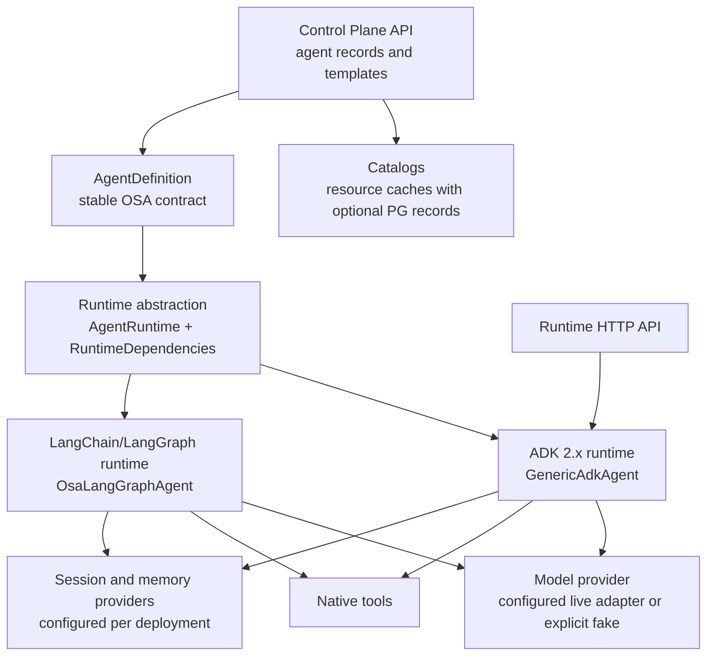

# Open Simple Agent

Open Simple Agent (OSA) is a configuration-driven platform for defining,
running, managing, and discovering autonomous AI agents. It focuses on agents,
not workflows: an agent combines instructions, a model, tools, MCP servers,
skills, memory, and session settings and is executed by a runtime.

OSA ships two runtime backends behind the same framework-neutral OSA
contracts: [Google ADK 2.x](https://google.github.io/adk-docs/) and a
LangChain/LangGraph backend. The ADK backend remains the packaged HTTP/A2A
service runtime; the LangGraph backend is currently a programmatic runtime
slice for backend evaluation and coexistence.

> **Development status:** OSA is an early-stage framework. The domain model,
> deployment bundles, control-plane API, runnable ADK runtime, LangChain/
> LangGraph runtime slice, MCP runtime,
> PostgreSQL persistence, A2A interoperability, the `osa-runtime` service CLI,
> production-oriented images, release supply-chain automation, and the
> React/TypeScript Control Panel are implemented. JWT bearer authentication,
> opt-in role/permission enforcement, and runtime tenant binding are available.
> The remaining production-readiness work is tracked in `TODO.md`: distributed
> deployment operation ownership,
> distributed A2A active-task state, replica-wide telemetry, deployment-specific
> browser OIDC, and release decisions. Durable sessions, migration-owned memory
> schema, capability telemetry, and the opt-in HTTP rate-limit contract
> (including an optional PostgreSQL shared store) are implemented. The Kind
> lifecycle workflow passes in CI; live-provider acceptance remains opt-in.

## What works today

| Area | Current implementation | Important limitation |
|---|---|---|
| Agent definition | Strict Pydantic schema; YAML loading; `OSA_*` overrides; versioned deployment bundles | Public agent-definition bundle import/export APIs are not exposed; deployment export and resource import/export are implemented |
| Models | Catalog, provider contract, LiteLLM production adapter (ADR-001), deterministic fake bridge | Live-model CI acceptance is opt-in via `OSA_LIVE_PROVIDER_API_KEY` |
| Native tools | Catalog, declared parameter schemas, ADK-native function calling, timeout enforcement | Built-in implementations only (`calculator`); custom toolsets need code |
| MCP | Runtime client (stdio + Streamable HTTP), lazy pooled connections, filtered namespaced tools bridged to ADK, bounded results, API-key/OAuth2/mTLS outbound credentials | Resources/prompts exposure and legacy SSE transport are deferred until a concrete requirement |
| Skills | Catalog, search, runtime metadata resolution, A2A Agent Card mapping | Definition policy can allow/deny referenced skills |
| Sessions | `SessionProvider` contract, ownership (agent/user/tenant), TTL, bounded history fed back to the model, versioned PostgreSQL provider with optimistic concurrency and explicit `osa-session-migrate` schema ownership | In-memory remains the default; persistent sessions are opt-in per agent |
| Memory | Policy catalog resolution (authoritative scope/limits/retention), scope-id isolation (user/agent/tenant/application), enforcement after every write, explicit writes, PostgreSQL persistence (ADR-003), explicit `osa-memory-migrate` schema ownership | Extraction pipeline (auto-extract) reserved; vector search deferred |
| ADK runtime | Invocation through the ADK `Runner`; timeouts, iteration limits, stable error types; SSE streaming (`/v1/invoke/stream`) with stable OSA events and disconnect cancellation; A2A Agent Card + JSON-RPC server (ADR-005); optional SDK PostgreSQL task store via `OSA_A2A_TASK_DATABASE_URL` | Token-level streaming requires a streaming model; active A2A executor ownership/cancellation/recovery remain process-local |
| LangChain/LangGraph runtime | `osa-langgraph-runtime` uses LangChain chat models/tools and a LangGraph `StateGraph` model/tool loop; shares OSA catalogs, policies, sessions, memory, timeouts, stable responses, and streaming events | Programmatic backend only; MCP, A2A, and a framework-neutral HTTP service adapter are not yet included |
| Control Plane | Agent CRUD, lifecycle transitions, immutable versions, optimistic concurrency, validated contracts; tenant-owned agent CRUD/lifecycle routes; tenant-scoped resource CRUD/list/search APIs with reference checks and bundle import/export; tenant-owned deployment APIs (deploy/status/stop/restart/logs/rollback); durable external A2A agent registry with card validation, health, and outbound credential adapters; append-only tenant-filtered audit events; in-memory default or PostgreSQL repositories via `OSA_CONTROL_PLANE_DATABASE_URL` (ADR-004), Alembic schema (`osa-cp-migrate`); shared JWT bearer authentication, opt-in route permissions, and operator-selected local/Kubernetes deployment providers | Durable Control Plane deployments require Kubernetes; local provider is development-only; definition resource policy is enforced by the runtime and enterprise policy remains open |
| Control Panel | React/TypeScript/Vite shell; session-scoped Bearer token and locale support; typed Control Plane client; agents, templates, tenant-scoped resources, readiness, agent detail/version history, safe immutable snapshot inspection, deployments, audit/metrics, authoring, A2A console, managed-runtime invocation, and responsive/loading/empty/error states | English and Arabic are implemented; further locales and deployment-specific OIDC login remain product/deployment concerns |
| Deployment | Local provider with bounded logs, health probing, startup-failure capture, identity-aware retry, safe bundle export, and persisted deploy/status/stop/restart/logs/rollback APIs; operator-selected Kubernetes provider with labelled status rehydration, probes, scaling, rollback, logs, bundle ConfigMaps, Secret references, and hardened pod security | Kind acceptance passes in CI; distributed operation ownership remains gated |
| Runtime API | Invoke, capabilities, liveness, readiness, optional A2A Agent Card/JSON-RPC, shared JWT/OIDC bearer authentication including RFC 7662 opaque-token introspection, opt-in route permissions, tenant-claim binding, request IDs, Prometheus metrics including model/tool/MCP capability outcomes, optional bounded JSONL capability sink, redaction-safe structured logs and runtime/A2A audit events; SSE streaming (`/v1/invoke/stream`) with stable OSA events; `osa-runtime` CLI with bundle bootstrap; shared outbound URL/DNS/redirect policy; opt-in bounded HTTP rate-limit contract with optional PostgreSQL shared store | In-memory rate limiting and JSONL sink are process-local by default; long-running operation ownership, global gateway quotas, and shared telemetry collection remain deployment concerns |
| CI | Ruff format/lint, strict mypy, full Python suite with PostgreSQL + A2A services and an 84% coverage gate, Control Panel typecheck/test/build, both image smoke tests, Docker-backed Kind Kubernetes lifecycle acceptance, dependency/license scanning, CycloneDX SBOMs, a gated live-provider acceptance job, and a manual enterprise-identity acceptance workflow | Live-provider and enterprise-identity execution require opt-in credentials; multi-process deployment-operation ownership remains gated |
| Release | Lockstep release validation; four Python distributions; GHCR runtime/Control Plane images; SBOM/provenance attestations; keyless Cosign image signing; GitHub Releases with checksums; immutable-digest channel rollback | First public release and optional package-registry publication remain open |

## Architecture



The Control Plane stores definitions and management metadata. Agent invocation
belongs to the data plane and does not route through the Control Plane. Runtime
framework objects do not leak into the generic contracts.

See [Architecture](docs/ARCHITECTURE.md) for the implemented flows, boundaries,
and known gaps.

## Agent definition

```yaml
apiVersion: osa/v1alpha1
kind: Agent

metadata:
  name: customer-support
  version: 1.0.0
  description: Customer support assistant
  labels:
    team: service

spec:
  instruction: |
    Assist customers with support requests.
    Use available tools when required.
    Do not invent customer information.

  model:
    ref: default

  mcps:
    - ref: crm
      tools_filter:
        - get_customer

  tools:
    - calculator

  skills:
    - customer-support

  memory:
    enabled: true
    policy: user-memory
    scope: user

  session:
    persistence: false

  a2a:
    enabled: false

  runtime:
    timeout_seconds: 30
    max_iterations: 3
```

Bare strings are accepted for model, MCP, tool, and skill references. For
example, `- calculator` is equivalent to `- ref: calculator`.

The definition is validated today, but a complete deployment bundle must also
provide the referenced catalog objects and their runtime implementations.

See [Configuration reference](docs/CONFIGURATION.md) for exact fields,
defaults, environment overrides, and runtime behavior.

## Development setup

Requirements:

- Python 3.12+
- [uv](https://docs.astral.sh/uv/)
- Node.js 22+ for Control Panel development

```bash
git clone https://github.com/bassemZohdy/open-simple-agent.git
cd open-simple-agent
uv sync --all-packages --extra postgres --extra a2a
uv run pytest --tb=short -q
uv run mypy .
uv run ruff format --check .
uv run ruff check .
```

`uv sync --all-packages` is required because this is a four-member uv
workspace. A bare `uv sync` does not install the member packages. The
`postgres` and `a2a` extras match CI: without them, the PostgreSQL (needs
`OSA_TEST_DATABASE_URL`) and A2A integration tests are skipped instead of
run, and `test_a2a.py` is collection-guarded so a bare sync still passes.

The Control Panel is a separate frontend package:

```bash
cd control-plane/frontend
npm ci --ignore-scripts
npm run dev
```

Set `VITE_OSA_API_BASE_URL` when the Control Plane is not available at
`http://localhost:8000`. See
[Control Panel development](control-plane/frontend/README.md) for its current
scope and authentication behavior.

## Using the current Python API

The deterministic vertical slice can be exercised without a paid model:

```python
import asyncio

from osa.generic_agent import AgentRequest, FakeModelProvider, load_agent_definition
from osa.runtimes.adk import AdkRuntime


definition = load_agent_definition(
    """
apiVersion: osa/v1alpha1
kind: Agent
metadata:
  name: hello-agent
spec:
  instruction: Answer briefly.
"""
)


async def main() -> None:
    runtime = AdkRuntime(model_provider=FakeModelProvider("Hello from OSA"))
    agent = await runtime.create(definition)
    response = await agent.invoke(AgentRequest(input="Hello"))
    print(response.output)
    await runtime.shutdown()


asyncio.run(main())
```

The same definition can be run through the LangChain/LangGraph backend. It
uses LangChain's `init_chat_model` adapter for provider-specific live models,
an optional LiteLLM compatibility adapter, and an explicit OSA `ModelProvider`
bridge for deterministic tests:

```python
from osa.runtimes.langgraph import LangGraphRuntime


async def main() -> None:
    runtime = LangGraphRuntime(model_provider=FakeModelProvider("Hello from LangGraph"))
    agent = await runtime.create(definition)
    response = await agent.invoke(AgentRequest(input="Hello"))
    print(response.output)
    await runtime.shutdown()
```

Both backends consume the generic `AgentRuntime` and `Agent` contracts. The
LangGraph backend is intentionally programmatic in this slice; the existing
`osa-runtime` CLI and HTTP/A2A surface remain ADK-backed until a shared
framework-neutral service adapter is added. Install the package's `providers`
extra for direct provider integrations or its `litellm` extra to reuse an OSA
model entry with `provider: litellm`.

## Running an agent

Load a deployment bundle and serve it:

```bash
# Deterministic smoke bundle (explicit fake-provider opt-in, no network)
OSA_ALLOW_FAKE_PROVIDER=1 uv run osa-runtime --config examples/smoke-bundle --port 8080
```

Runnable example bundles live under `examples/`, each loadable as-is:

| Example | Demonstrates |
|---|---|
| `examples/minimal` | Smallest possible agent: one model reference, no tools |
| `examples/native-tool` | A native tool definition (the builtin `calculator`) with `tools_filter`-free wiring |
| `examples/memory` | User-scoped memory behind an explicit `MemoryPolicy` (limits + retention) |
| `examples/mcp` | A local stdio MCP server (`examples/mcp/server.py`) with a tool filter |
| `examples/smoke-bundle` | The CI container smoke configuration |

Every example is schema-validated and reference-checked by
`tests/unit/test_examples.py` in CI; the MCP example's bundled server is
spawned by the runtime over stdio. Point `spec.model` at a live provider
(e.g. `provider: litellm` with credentials in the environment) to move an
example from deterministic to real-model execution.

A production bundle uses a live provider (see
[ADR-001](docs/adrs/001-litellm-model-adapter.md)) and resolves credentials
from the environment:

```bash
export OPENAI_API_KEY=...
uv run osa-runtime --config ./my-bundle --port 8080
```

The service validates the bundle, resolves every reference and secret, and
only then reports `/health/ready`; SIGTERM shuts it down gracefully. The
container image runs the same way with a mounted bundle:

```bash
docker build -t osa-runtime .
docker run -p 8080:8080 -e OSA_ALLOW_FAKE_PROVIDER=1 \
  -v "$PWD/examples/smoke-bundle:/app/config:ro" osa-runtime
```

## HTTP APIs

Two FastAPI applications exist:

- Control Plane development app: `osa.control_plane.backend.api:app` (always
  in-memory)
- Configured/production Control Plane: the
  `osa.control_plane.backend.service:create_control_plane_app` factory
- Agent runtime: `osa.runtimes.adk.api:runtime_app` (or the `osa-runtime` CLI)
  The LangChain/LangGraph backend is currently programmatic; use
  `osa.runtimes.langgraph.service:build_runtime` for bundle bootstrap.

The Control Plane can be started for development after setup:

```bash
uv run uvicorn osa.control_plane.backend.api:app --reload
```

Use the factory when `OSA_CONTROL_PLANE_DATABASE_URL` should select the
PostgreSQL repositories:

```bash
uv run uvicorn osa.control_plane.backend.service:create_control_plane_app --factory
```

Both APIs use the stable error envelope `{"error": {"code", "message"}}` and
enforce session ownership, lifecycle transitions, and optimistic concurrency
where applicable. Authentication is disabled by default for development; set
`OSA_AUTH_MODE=required` with an issuer and audience to require signed JWT
bearer tokens on non-health endpoints. `OSA_AUTH_JWKS_URL` may pin an explicit
key endpoint; when omitted, OSA resolves the issuer's standard OIDC discovery
document and validates its `jwks_uri`. Set
`OSA_AUTH_ENFORCE_PERMISSIONS=true` to apply the documented role/permission
checks to known management, resource, deployment, external-agent, audit, A2A,
and invocation routes. See the
[API reference](docs/API.md) for the exact endpoints and auth contract.

## Repository structure

```text
open-simple-agent/
├── control-plane/backend/   # FastAPI management API and repositories
├── control-plane/frontend/  # React/TypeScript administrative Control Panel
├── generic-agent/           # Stable domain model, bundles, and runtime contracts
├── runtimes/adk/            # Google ADK runtime, model adapters, service CLI
├── runtimes/langgraph/      # LangChain/LangGraph runtime backend
├── docs/                    # Architecture, configuration, API, guides, and ADRs
├── examples/                # Runnable bundles
├── tests/                   # Python unit/integration tests
├── Dockerfile               # Production runtime image (non-root, health check)
├── Dockerfile.control-plane # Production Control Plane image
├── control-plane/frontend/   # Production UI image and SPA fallback config
└── TODO.md                  # Active prioritized implementation backlog
```

## Core decisions

- Configuration is the normal way to define agents; business-specific agent
  subclasses are not required for standard use cases.
- OSA is not a workflow engine and does not define a workflow DSL.
- The Control Plane and data plane remain separate.
- MCP is modeled separately from native tools because it may expose tools,
  resources, and prompts.
- Sessions and long-term memory are separate concepts.
- ADK and LangChain/LangGraph are independent implementations behind shared
  OSA contracts; cross-framework behavioral equivalence is validated only for
  the generic invocation, policy, session, memory, and streaming surfaces.
- OSA is an independent project. No architecture, dependency, or
  interoperability relationship with the Micro-Agents project is defined.

## Documentation

- [Project definition](PROJECT_DEFINITION.md) — product scope and target architecture
- [Architecture](docs/ARCHITECTURE.md) — current components and execution flows
- [Configuration](docs/CONFIGURATION.md) — current schema and environment overrides
- [API reference](docs/API.md) — implemented HTTP endpoints
- [Control Panel](control-plane/frontend/README.md) — frontend development and current UI scope
- [Contributing](CONTRIBUTING.md) — setup, checks, and contribution rules
- [Backlog](TODO.md) — prioritized work and acceptance criteria
- [Operations guide](docs/guides/operations.md) — health, observability, deployments, upgrades
- [Deployment guide](docs/guides/deployment.md) — runtime/Control Plane configuration and containers
- [Security guide](docs/guides/security.md) — authentication, tenancy, secrets, policy, supply chain
- [Upgrade guide](docs/guides/upgrade.md) — lockstep versions, migrations, rollbacks
- [Changelog](CHANGELOG.md) — development history

## Release status

The P0 runnable-agent gate, managed-platform foundation, current Control Panel,
and production images are implemented. Release automation can build validated
Python artifacts and signed/attested GHCR images from an intentional
version/tag. The remaining gated work is listed in [TODO.md](TODO.md), notably
distributed deployment operation ownership, distributed A2A active-task state,
replica-wide telemetry, deployment-specific browser OIDC, and the first public
release decision. Live-provider acceptance is available
when its repository secret is intentionally enabled.

## License

Apache License 2.0. See [LICENSE](LICENSE).
