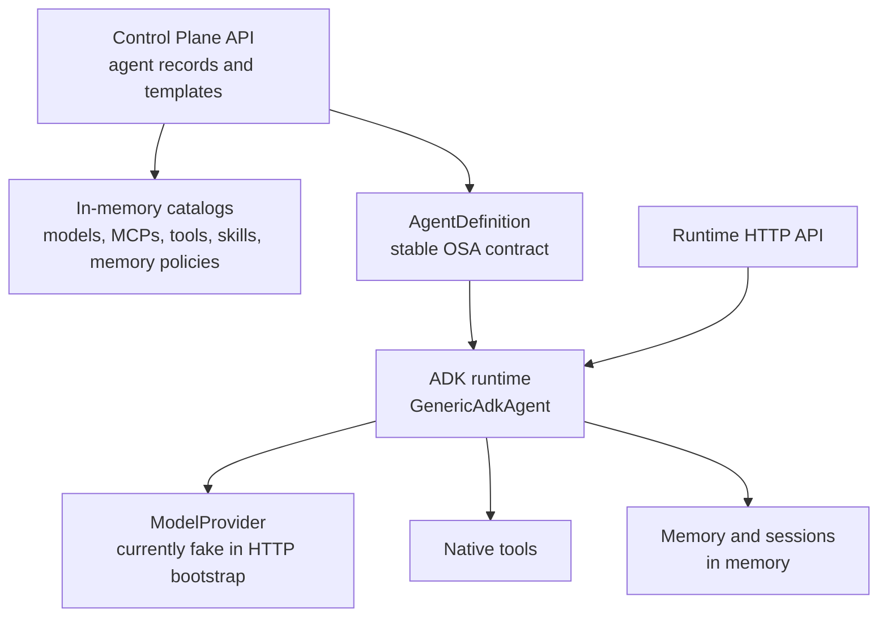

# Open Simple Agent

Open Simple Agent (OSA) is a configuration-driven platform for defining,
running, managing, and discovering autonomous AI agents. It focuses on agents,
not workflows: an agent combines instructions, a model, tools, MCP servers,
skills, memory, and session settings and is executed by a runtime.

The first runtime targets [Google ADK](https://google.github.io/adk-docs/).

> **Development status:** OSA is an early-stage framework prototype. The domain
> model, in-memory catalogs, control-plane API, ADK runtime skeleton, local
> process deployment provider, and deterministic tests are implemented. A
> runnable real-model service, MCP runtime client, persistent storage, A2A,
> authentication, production images, and the UI are not implemented yet.

## What works today

| Area | Current implementation | Important limitation |
|---|---|---|
| Agent definition | Strict Pydantic schema; YAML loading; selected `OSA_*` overrides | No catalog/config bundle loader |
| Models | In-memory catalog and provider contract | Only a deterministic fake provider is wired into HTTP startup |
| Native tools | Catalog, resolution, timeout, execution loop, ADK wrappers | Invocation still uses a transitional `TOOL_CALL` text protocol |
| MCP | Definitions, catalog, transports, credential references | No client, discovery, connection lifecycle, or tool invocation |
| Skills | Catalog, search, runtime metadata resolution | No A2A Agent Card mapping |
| Sessions | In-memory manager and response session IDs | History is not added to prompts; TTL/persistence settings are not enforced |
| Memory | Provider contract, in-memory provider, search-based context, explicit writes | Policy resolution, limits, retention, extraction, and persistence are pending |
| ADK runtime | `LlmAgent` and `Runner` construction | Live invocation does not go through the ADK Runner |
| Control Plane | In-memory agent CRUD/version API and resource catalog classes | Resource/deployment APIs and persistence are pending |
| Deployment | Local subprocess provider contract and implementation | Not connected to the Control Plane API; no container/Kubernetes provider |
| Runtime API | Invoke, capabilities, liveness, and readiness routes | Requires programmatic initialization; no executable bootstrap |
| CI | Format, lint, strict mypy, and 221 automated tests | No coverage gate, container build, security scan, or release automation |

## Architecture



The Control Plane stores definitions and management metadata. Agent invocation
belongs to the data plane and does not route through the Control Plane. Runtime
framework objects do not leak into the generic contracts.

See [Architecture](docs/ARCHITECTURE.md) for the implemented flows, boundaries,
and known gaps.

## Agent definition

```yaml
apiVersion: osa/v1alpha1
kind: Agent

metadata:
  name: customer-support
  version: 1.0.0
  description: Customer support assistant
  labels:
    team: service

spec:
  instruction: |
    Assist customers with support requests.
    Use available tools when required.
    Do not invent customer information.

  model:
    ref: default

  mcps:
    - ref: crm
      tools_filter:
        - get_customer

  tools:
    - calculator

  skills:
    - customer-support

  memory:
    enabled: true
    policy: user-memory
    scope: user

  session:
    persistence: false

  a2a:
    enabled: false

  runtime:
    timeout_seconds: 30
    max_iterations: 3
```

Bare strings are accepted for model, MCP, tool, and skill references. For
example, `- calculator` is equivalent to `- ref: calculator`.

The definition is validated today, but a complete deployment bundle must also
provide the referenced catalog objects and their runtime implementations.

See [Configuration reference](docs/CONFIGURATION.md) for exact fields,
defaults, environment overrides, and runtime behavior.

## Development setup

Requirements:

- Python 3.12+
- [uv](https://docs.astral.sh/uv/)

```bash
git clone https://github.com/bassemZohdy/open-simple-agent.git
cd open-simple-agent
uv sync --all-packages
uv run pytest --tb=short -q
uv run mypy .
uv run ruff format --check .
uv run ruff check .
```

`uv sync --all-packages` is required because this is a three-member uv
workspace. A bare `uv sync` does not install the member packages.

## Using the current Python API

The deterministic vertical slice can be exercised without a paid model:

```python
import asyncio

from osa.generic_agent import AgentRequest, FakeModelProvider, load_agent_definition
from osa.runtimes.adk import AdkRuntime


definition = load_agent_definition(
    """
apiVersion: osa/v1alpha1
kind: Agent
metadata:
  name: hello-agent
spec:
  instruction: Answer briefly.
"""
)


async def main() -> None:
    runtime = AdkRuntime(model_provider=FakeModelProvider("Hello from OSA"))
    agent = await runtime.create(definition)
    response = await agent.invoke(AgentRequest(input="Hello"))
    print(response.output)
    await runtime.shutdown()


asyncio.run(main())
```

## HTTP APIs

Two FastAPI applications exist:

- Control Plane: `osa.control_plane.backend.api:app`
- Agent runtime: `osa.runtimes.adk.api:runtime_app`

The Control Plane can be started for development after setup:

```bash
uv run uvicorn osa.control_plane.backend.api:app --reload
```

The runtime application cannot yet be started as a useful standalone service:
it must first receive an `AgentDefinition` through the programmatic
`initialize_runtime()` function. Adding a configuration bootstrap and real
provider wiring is the first backlog priority.

See [API reference](docs/API.md) for the exact implemented endpoints and known
error/validation limitations.

## Repository structure

```text
open-simple-agent/
├── control-plane/backend/   # FastAPI management API and in-memory catalogs
├── generic-agent/           # Stable domain model and runtime contracts
├── runtimes/adk/            # Google ADK runtime adapter and runtime API
├── docs/                    # Architecture, configuration, API, and ADRs
├── tests/                   # Unit and integration tests
├── Dockerfile               # Unverified base image; no service command yet
└── TODO.md                  # Prioritized implementation backlog
```

The planned React Control Panel does not exist in the repository yet.

## Core decisions

- Configuration is the normal way to define agents; business-specific agent
  subclasses are not required for standard use cases.
- OSA is not a workflow engine and does not define a workflow DSL.
- The Control Plane and data plane remain separate.
- MCP is modeled separately from native tools because it may expose tools,
  resources, and prompts.
- Sessions and long-term memory are separate concepts.
- ADK is the initial implementation; cross-framework behavioral equivalence is
  not a goal.
- OSA is an independent project. No architecture, dependency, or
  interoperability relationship with the Micro-Agents project is defined.

## Documentation

- [Project definition](PROJECT_DEFINITION.md) — product scope and target architecture
- [Architecture](docs/ARCHITECTURE.md) — current components and execution flows
- [Configuration](docs/CONFIGURATION.md) — current schema and environment overrides
- [API reference](docs/API.md) — implemented HTTP endpoints
- [Contributing](CONTRIBUTING.md) — setup, checks, and contribution rules
- [Backlog](TODO.md) — prioritized work and acceptance criteria
- [Changelog](CHANGELOG.md) — development history

## Next release gate

The next meaningful release is a runnable real-model vertical slice:

1. Load an agent and its referenced catalogs from external configuration.
2. Resolve secrets without placing values in agent definitions.
3. Invoke a live model through the ADK Runner and native function calling.
4. Preserve isolated conversational context through a session provider.
5. Start through a supported CLI/service command and production-oriented image.

See [TODO.md](TODO.md) for the dependency-ordered backlog.

## License

Apache License 2.0. See [LICENSE](LICENSE).
