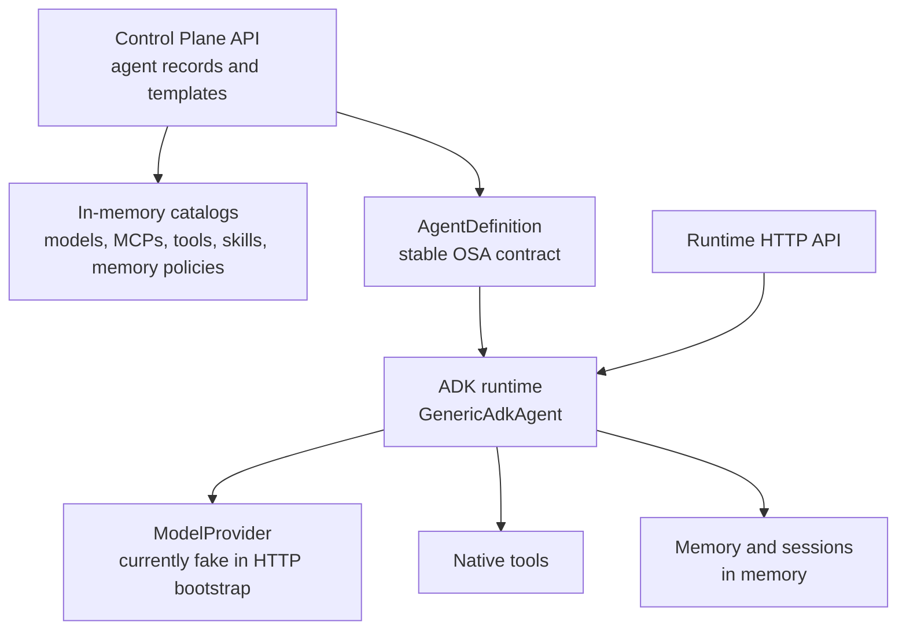

# Open Simple Agent

Open Simple Agent (OSA) is a configuration-driven platform for defining,
running, managing, and discovering autonomous AI agents. It focuses on agents,
not workflows: an agent combines instructions, a model, tools, MCP servers,
skills, memory, and session settings and is executed by a runtime.

The first runtime targets [Google ADK](https://google.github.io/adk-docs/).

> **Development status:** OSA is an early-stage framework. The domain model,
> deployment bundles, in-memory catalogs, control-plane API, a runnable
> real-model ADK runtime (LiteLLM adapter, native function calling, session
> isolation), MCP runtime, PostgreSQL persistence, A2A interoperability, the
> `osa-runtime` service CLI, a production-oriented container image, and
> deterministic tests are implemented. JWT bearer authentication, opt-in
> role/permission route enforcement, and runtime tenant binding are available;
> enterprise policy, streaming, Kubernetes deployment, and the UI remain open.

## What works today

| Area | Current implementation | Important limitation |
|---|---|---|
| Agent definition | Strict Pydantic schema; YAML loading; `OSA_*` overrides; versioned deployment bundles | Bundle import/export APIs pending |
| Models | Catalog, provider contract, LiteLLM production adapter (ADR-001), deterministic fake bridge | Live-model CI job pending |
| Native tools | Catalog, declared parameter schemas, ADK-native function calling, timeout enforcement | Built-in implementations only (`calculator`); custom toolsets need code |
| MCP | Runtime client (stdio + Streamable HTTP), lazy pooled connections, filtered namespaced tools bridged to ADK, bounded results, API-key/OAuth2/mTLS outbound credentials | Resources/prompts exposure and SSE pending |
| Skills | Catalog, search, runtime metadata resolution, A2A Agent Card mapping | Definition policy can allow/deny referenced skills |
| Sessions | `SessionProvider` contract, ownership (agent/user/tenant), TTL, bounded history fed back to the model | In-memory only; not replica-safe |
| Memory | Policy catalog resolution (authoritative scope/limits/retention), scope-id isolation (user/agent/tenant/application), enforcement after every write, explicit writes, PostgreSQL persistence (ADR-003) | Extraction pipeline (auto-extract) reserved; vector search deferred |
| ADK runtime | Invocation through the ADK `Runner`; timeouts, iteration limits, stable error types; SSE streaming (`/v1/invoke/stream`) with stable OSA events and disconnect cancellation; A2A Agent Card + JSON-RPC server (ADR-005) | Token-level streaming requires a streaming model |
| Control Plane | Agent CRUD, lifecycle transitions, immutable versions, optimistic concurrency, validated contracts; tenant-owned agent CRUD/lifecycle routes; tenant-scoped resource CRUD/list/search APIs with reference checks and bundle import/export; tenant-owned deployment APIs (deploy/status/stop/restart/logs/rollback); external A2A agent registry with card validation, health, and outbound credential adapters; append-only tenant-filtered audit events; in-memory default or PostgreSQL repositories via `OSA_CONTROL_PLANE_DATABASE_URL` (ADR-004), Alembic schema (`osa-cp-migrate`); shared JWT bearer authentication and opt-in route permissions | Definition resource policy is enforced by the runtime; enterprise policy remains open |
| Deployment | Local provider with bounded logs, health probing, and startup-failure capture; deploy/status/stop/restart/logs/rollback APIs through the Control Plane with persisted tenant-owned records | Kubernetes provider pending |
| Runtime API | Invoke, capabilities, liveness, readiness, optional A2A Agent Card/JSON-RPC, shared JWT/OIDC bearer authentication including RFC 7662 opaque-token introspection, opt-in route permissions, tenant-claim binding, request IDs, Prometheus metrics, redaction-safe structured logs and runtime/A2A audit events; SSE streaming (`/v1/invoke/stream`) with stable OSA events; `osa-runtime` CLI with bundle bootstrap | - |
| CI | Format, lint, strict mypy, 466 collected tests (445 local plus 21 PostgreSQL tests in CI), container build + smoke test | No coverage gate, security scan, or release automation |

## Architecture



The Control Plane stores definitions and management metadata. Agent invocation
belongs to the data plane and does not route through the Control Plane. Runtime
framework objects do not leak into the generic contracts.

See [Architecture](docs/ARCHITECTURE.md) for the implemented flows, boundaries,
and known gaps.

## Agent definition

```yaml
apiVersion: osa/v1alpha1
kind: Agent

metadata:
  name: customer-support
  version: 1.0.0
  description: Customer support assistant
  labels:
    team: service

spec:
  instruction: |
    Assist customers with support requests.
    Use available tools when required.
    Do not invent customer information.

  model:
    ref: default

  mcps:
    - ref: crm
      tools_filter:
        - get_customer

  tools:
    - calculator

  skills:
    - customer-support

  memory:
    enabled: true
    policy: user-memory
    scope: user

  session:
    persistence: false

  a2a:
    enabled: false

  runtime:
    timeout_seconds: 30
    max_iterations: 3
```

Bare strings are accepted for model, MCP, tool, and skill references. For
example, `- calculator` is equivalent to `- ref: calculator`.

The definition is validated today, but a complete deployment bundle must also
provide the referenced catalog objects and their runtime implementations.

See [Configuration reference](docs/CONFIGURATION.md) for exact fields,
defaults, environment overrides, and runtime behavior.

## Development setup

Requirements:

- Python 3.12+
- [uv](https://docs.astral.sh/uv/)

```bash
git clone https://github.com/bassemZohdy/open-simple-agent.git
cd open-simple-agent
uv sync --all-packages
uv run pytest --tb=short -q
uv run mypy .
uv run ruff format --check .
uv run ruff check .
```

`uv sync --all-packages` is required because this is a three-member uv
workspace. A bare `uv sync` does not install the member packages.

## Using the current Python API

The deterministic vertical slice can be exercised without a paid model:

```python
import asyncio

from osa.generic_agent import AgentRequest, FakeModelProvider, load_agent_definition
from osa.runtimes.adk import AdkRuntime


definition = load_agent_definition(
    """
apiVersion: osa/v1alpha1
kind: Agent
metadata:
  name: hello-agent
spec:
  instruction: Answer briefly.
"""
)


async def main() -> None:
    runtime = AdkRuntime(model_provider=FakeModelProvider("Hello from OSA"))
    agent = await runtime.create(definition)
    response = await agent.invoke(AgentRequest(input="Hello"))
    print(response.output)
    await runtime.shutdown()


asyncio.run(main())
```

## Running an agent

Load a deployment bundle and serve it:

```bash
# Deterministic smoke bundle (explicit fake-provider opt-in, no network)
OSA_ALLOW_FAKE_PROVIDER=1 uv run osa-runtime --config examples/smoke-bundle --port 8080
```

A production bundle uses a live provider (see
[ADR-001](docs/adrs/001-litellm-model-adapter.md)) and resolves credentials
from the environment:

```bash
export OPENAI_API_KEY=...
uv run osa-runtime --config ./my-bundle --port 8080
```

The service validates the bundle, resolves every reference and secret, and
only then reports `/health/ready`; SIGTERM shuts it down gracefully. The
container image runs the same way with a mounted bundle:

```bash
docker build -t osa-runtime .
docker run -p 8080:8080 -e OSA_ALLOW_FAKE_PROVIDER=1 \
  -v "$PWD/examples/smoke-bundle:/app/config:ro" osa-runtime
```

## HTTP APIs

Two FastAPI applications exist:

- Control Plane: `osa.control_plane.backend.api:app`
- Agent runtime: `osa.runtimes.adk.api:runtime_app` (or the `osa-runtime` CLI)

The Control Plane can be started for development after setup:

```bash
uv run uvicorn osa.control_plane.backend.api:app --reload
```

Both APIs use the stable error envelope `{"error": {"code", "message"}}` and
enforce session ownership, lifecycle transitions, and optimistic concurrency
where applicable. Authentication is disabled by default for development; set
`OSA_AUTH_MODE=required` with an issuer and audience to require signed JWT
bearer tokens on non-health endpoints. `OSA_AUTH_JWKS_URL` may pin an explicit
key endpoint; when omitted, OSA resolves the issuer's standard OIDC discovery
document and validates its `jwks_uri`. Set
`OSA_AUTH_ENFORCE_PERMISSIONS=true` to apply the documented role/permission
checks to known management, resource, deployment, external-agent, audit, A2A,
and invocation routes. See the
[API reference](docs/API.md) for the exact endpoints and auth contract.

## Repository structure

```text
open-simple-agent/
├── control-plane/backend/   # FastAPI management API and in-memory catalogs
├── generic-agent/           # Stable domain model, bundles, and runtime contracts
├── runtimes/adk/            # Google ADK runtime, model adapters, service CLI
├── docs/                    # Architecture, configuration, API, and ADRs
├── examples/                # Runnable bundles (smoke bundle)
├── tests/                   # Unit and integration tests
├── Dockerfile               # Production runtime image (non-root, health check)
└── TODO.md                  # Prioritized implementation backlog
```

The planned React Control Panel does not exist in the repository yet.

## Core decisions

- Configuration is the normal way to define agents; business-specific agent
  subclasses are not required for standard use cases.
- OSA is not a workflow engine and does not define a workflow DSL.
- The Control Plane and data plane remain separate.
- MCP is modeled separately from native tools because it may expose tools,
  resources, and prompts.
- Sessions and long-term memory are separate concepts.
- ADK is the initial implementation; cross-framework behavioral equivalence is
  not a goal.
- OSA is an independent project. No architecture, dependency, or
  interoperability relationship with the Micro-Agents project is defined.

## Documentation

- [Project definition](PROJECT_DEFINITION.md) — product scope and target architecture
- [Architecture](docs/ARCHITECTURE.md) — current components and execution flows
- [Configuration](docs/CONFIGURATION.md) — current schema and environment overrides
- [API reference](docs/API.md) — implemented HTTP endpoints
- [Contributing](CONTRIBUTING.md) — setup, checks, and contribution rules
- [Backlog](TODO.md) — prioritized work and acceptance criteria
- [Changelog](CHANGELOG.md) — development history

## Release status

The P0 "runnable agent" gate is implemented: external bundle loading, secret
resolution, live-model invocation through the ADK Runner with native function
calling, isolated session continuity, and a CLI/container service path — the
same acceptance test passes locally and from the built container. Remaining
work is tracked in [TODO.md](TODO.md): Kubernetes deployment (Kind validation
planned; OpenShift deferred), enterprise authorization policy, streaming/replica behavior, UI, and
release automation.

## License

Apache License 2.0. See [LICENSE](LICENSE).
