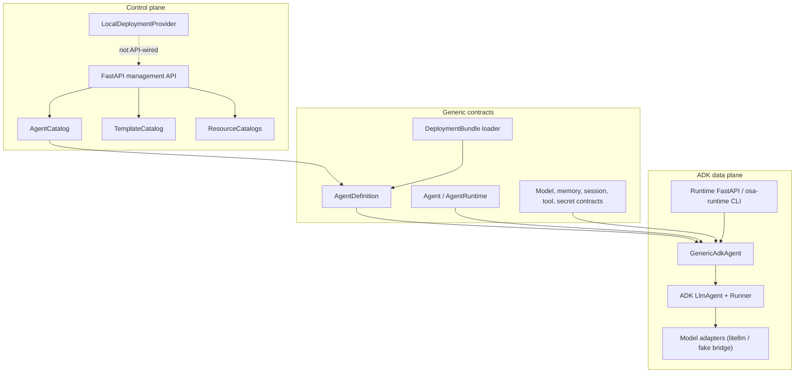
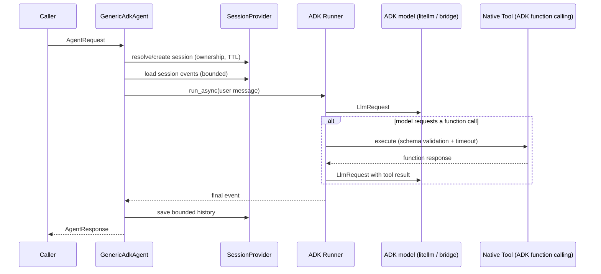

# Current Architecture

This document describes the source tree on `main`. It is an implementation
map, not a promise that planned capabilities exist.

## Workspace

OSA is a Python 3.12 uv workspace with three packages sharing the PEP 420
namespace `osa`:

| Package | Import root | Responsibility |
|---|---|---|
| `generic-agent` | `osa.generic_agent` | Domain model, configuration, deployment bundles, catalogs, provider contracts, errors |
| `runtimes/adk` | `osa.runtimes.adk` | ADK-specific construction, model adapters, MCP client/toolsets, memory persistence, session bridging, Runner invocation, runtime API, service CLI |
| `control-plane/backend` | `osa.control_plane.backend` | Agent records/templates/resources, local deployment provider, management API |

Namespace levels such as `src/osa/` intentionally have no `__init__.py`.

## Component map

## Agent construction

`AdkRuntime.create()` receives an already validated `AgentDefinition`. During
`GenericAdkAgent` construction it:

1. resolves every native tool definition and implementation (missing
   references fail fast);
2. resolves every skill definition (missing references fail fast);
3. resolves the model definition from the catalog — an unknown reference
   fails fast; an absent reference uses the catalog default, and with no
   default at all only an explicitly supplied deterministic provider may be
   used;
4. builds the ADK model through the adapter registry (`litellm` for live
   models, a `ModelProvider` bridge for deterministic tests);
5. builds an ADK `LlmAgent` with `OsaFunctionTool` wrappers whose
   declarations come from `ToolDefinition.capabilities`;
6. builds an ADK `Runner` wired to `OsaAdkSessionService`, which stores ADK
   events inside the OSA session provider.

## Invocation flow

Invocation flows through the ADK `Runner`. Tools execute through ADK-native
function calling — the earlier `TOOL_CALL` text protocol is gone.
`runtime.timeout_seconds` cancels the run (`invocation_timeout`);
`runtime.max_iterations` caps function-call rounds
(`iteration_limit_exceeded`). Generation settings follow explicit precedence:
`ModelDefinition.runtime_settings`, overridden by `ModelRef.parameters`.

## MCP runtime

`osa.runtimes.adk.mcp_client` connects to MCP servers over stdio or Streamable
HTTP (legacy SSE is rejected) using the official `mcp` SDK (ADR-002).
Connections are lazy, pooled per runtime (agents sharing a server share one
connection), owned by a keeper task so anyio cancel scopes are entered and
exited in one task, and closed on runtime shutdown. Server-level and
agent-level tool filters intersect; tools are namespaced `<server>_<tool>`
with origin metadata preserved and are resolved by ADK per invocation through
`OsaMcpToolset`. `GenericAdkAgent` pre-flights every MCP connection before a
run — ADK resolves toolsets fail-open (a dead server silently loses its
tools), which OSA replaces with a deterministic `mcp_connection_failed`
failure. Retries, timeouts, TLS verification, response-size caps, and
credential resolution (never storing values) follow `McpDefinition`.

## Sessions and memory

The OSA `SessionProvider` is the single source of truth for sessions:
ownership (`agent_name`, `user_id`, `tenant_id`), TTL expiry, bounded history
(`max_history_messages`), and the ADK event payload ADK reuses for context.
Caller-supplied unknown IDs are rejected (`session_not_found`), identity
changes are access violations (`session_access_denied`), and IDs are
server-issued UUIDs. `OsaAdkSessionService` maps ADK session operations onto
the provider, so model context stays bounded by the OSA history limit. The
in-memory provider is single-replica; multi-replica deployments need a shared
persistent provider (P1).

Memory context is loaded only when `spec.memory.enabled` is true and a
memory provider is configured. Search is a case-insensitive substring match;
writes occur only through `agent.remember()` (raw interactions are never
auto-persisted; `auto_extract` is reserved). The effective policy comes from
the memory policy catalog when `spec.memory.policy` is set (policy fields are
authoritative; a disabled policy disables memory) and limits — per-scope
`max_entries` eviction and `retention_days` purging — are enforced after
every write and before reads (ADR-003). Scope IDs derive from the invocation
context: `user` -> caller, `agent` -> agent name, `tenant` -> tenant
metadata, `application` -> deployment constant; entries never cross scope
IDs.

Persistence is externalized: `OSA_MEMORY_DATABASE_URL` selects
`PostgresMemoryProvider` (SQLAlchemy async over asyncpg, ILIKE search,
SQL-enforced limits/retention, schema ensured at startup); without it memory
is in-memory and single-process.

## HTTP applications

The Control Plane application owns module-level in-memory catalogs.
Restarting the process loses all state. Routes enforce create/transition
validation, cumulative list filters with pagination/sorting, immutable
version snapshots, optimistic concurrency (`expected_version`), and the
stable error envelope (`{"error": {"code", "message"}}`). Resource catalog
and deployment provider classes have no HTTP routes yet.

The runtime application owns one module-level runtime and agent. The
production path is the `osa-runtime` CLI (or `create_runtime_app`), which
loads a deployment bundle during startup: bundle validation, reference
resolution, and secret resolution all complete before readiness, and an
invalid bundle aborts startup. SIGTERM runs the lifespan shutdown and closes
the runtime cleanly. The runtime image (`Dockerfile`) runs non-root with an
arbitrary-UID-friendly layout, a health check, and an externally mounted
bundle; CI builds it and runs a container smoke test (ready → invoke →
SIGTERM).

Both APIs are unauthenticated (P2.2).

## Deployment

`DeploymentProvider` separates process lifecycle from in-process agent
execution. `LocalDeploymentProvider` launches a trusted command as a subprocess,
reports liveness, and supports stop/restart. It discards stdout/stderr, has no
health probe, and persists no state. It is not connected to the Control Plane
API (P1.5).

## Tests and CI

The current baseline is ~320 tests. CI runs:

- `ruff format --check .`;
- `ruff check .`;
- strict `mypy .` across all first-party packages;
- `pytest --tb=short -q`;
- a container job: `uv lock --check`, `docker build`, then a smoke test that
  starts the built image with the `examples/smoke-bundle` configuration,
  waits for readiness, performs an invocation, and verifies a clean SIGTERM
  exit.

Tests use the fake provider, scripted ADK models, in-memory services, a
deterministic stdio MCP server subprocess, and a localhost Streamable HTTP
MCP server — no external network. PostgreSQL memory tests run against a real
PostgreSQL 16 service in CI (`OSA_TEST_DATABASE_URL`) and skip locally when
unset. There is no live-model, Kubernetes, A2A, authentication, or
multi-replica test yet. There is no coverage threshold.

## Dependency risks

- `google-adk>=2.0,<3.0` pins the tested major line; ADK still emits its own
  `BaseAgentConfig` deprecation warning at import time (filtered in pytest,
  documented there).
- `litellm>=1.84` is optional (`osa-adk-runtime[litellm]`); configuring a
  litellm model without the extra fails fast (ADR-001).
- Package manifests share one lockstep release version, enforced by
  `tests/unit/test_versioning.py`; automated publishing is still pending
  (P3.3).

## Architectural invariants

- Generic contracts do not import ADK or FastAPI.
- The Control Plane stores definitions, not running agents.
- Agent invocation does not pass through the Control Plane.
- MCP definitions remain distinct from native tool definitions.
- Session and memory remain separate.
- Deployment providers remain separate from `AgentRuntime`.
- Secret values never appear in definitions, responses, logs, or errors.
- The `fake` provider is a deterministic test adapter, never a production
  fallback.
- OSA remains independent from the Micro-Agents project unless a future ADR
  explicitly changes that position.
