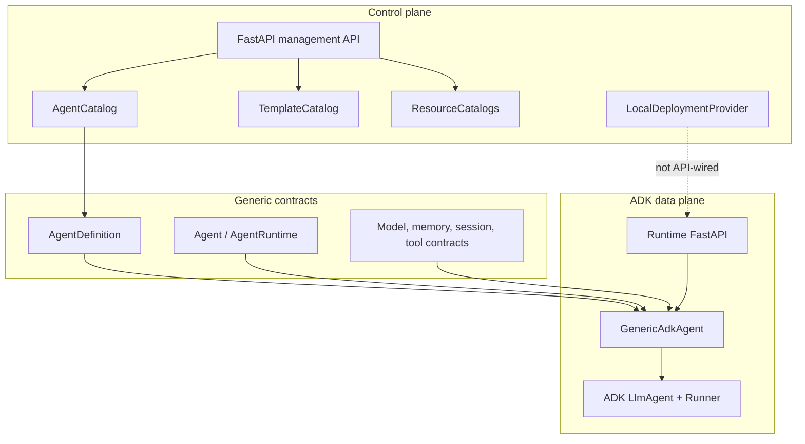
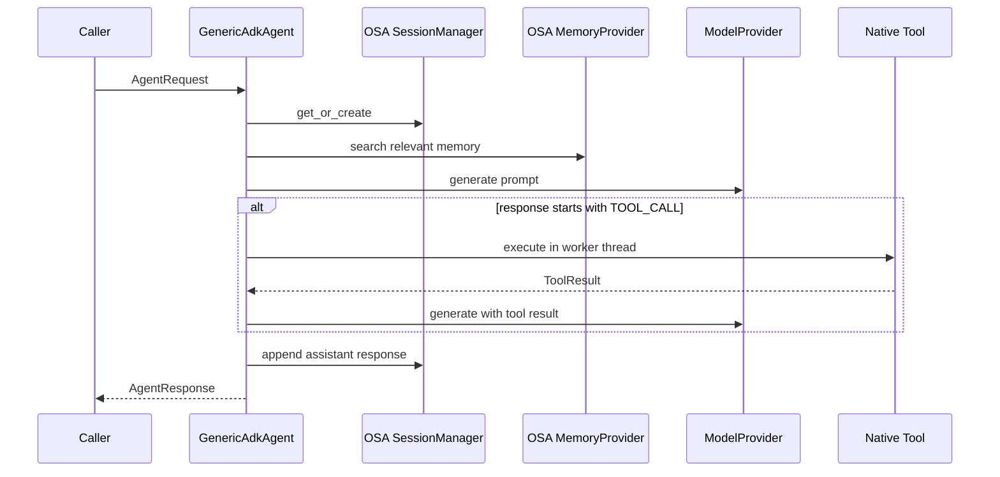

# Current Architecture

This document describes the source tree on `main` as reviewed on 2026-08-30.
It is an implementation map, not a promise that planned capabilities exist.

## Workspace

OSA is a Python 3.12 uv workspace with three packages sharing the PEP 420
namespace `osa`:

| Package | Import root | Responsibility |
|---|---|---|
| `generic-agent` | `osa.generic_agent` | Domain model, configuration, catalogs, provider contracts |
| `runtimes/adk` | `osa.runtimes.adk` | ADK-specific construction, invocation adapter, runtime API |
| `control-plane/backend` | `osa.control_plane.backend` | Agent records/templates/resources, local deployment provider, management API |

Namespace levels such as `src/osa/` intentionally have no `__init__.py`.

## Component map

## Agent construction

`AdkRuntime.create()` receives an already validated `AgentDefinition`. During
`GenericAdkAgent` construction it:

1. resolves every native tool definition and implementation;
2. resolves every skill definition;
3. resolves the configured model ID, falling back to `fake` when absent or
   unknown;
4. builds an ADK `LlmAgent` with wrapped native tools;
5. builds an ADK `Runner` with ADK in-memory session and memory services.

Missing tool or skill references fail construction. Missing models currently do
not; the fallback is an inconsistency tracked in `TODO.md`. MCP references and
memory policy references are not resolved during construction.

## Current invocation flow

This flow does **not** invoke `agent.runner`. ADK objects are constructed but
live execution remains on the generic provider path. Tool calling is parsed from
`TOOL_CALL <name> {json}` text and is bounded by `runtime.max_iterations`.

`runtime.timeout_seconds`, model reference parameters, model runtime settings,
and request metadata are not currently applied to generation.

## Sessions and memory

OSA session state and ADK Runner session state are separate in-memory services.
Current OSA sessions record user/assistant messages but history is not added to
the next model prompt. `SessionConfig.persistence` and `ttl_seconds` are schema
only.

Memory context is loaded only when `spec.memory.enabled` is true and a
`MemoryProvider` is injected. Search is a case-insensitive substring match in
the in-memory provider. Writes occur only through `agent.remember()`.
`MemoryConfig.policy`, `max_entries`, and policy retention/extraction settings
are not enforced.

Session lookup currently trusts a supplied session ID without verifying the
agent or user that owns it. Production session work must add ownership checks,
unguessable identifiers, expiry, and multi-replica storage.

## HTTP applications

The Control Plane application owns module-level in-memory catalogs. Restarting
the process loses all state. Only agent CRUD/version/disable routes are exposed;
resource catalog and deployment provider classes have no HTTP routes.

The runtime application owns one module-level runtime and agent. It must be
initialized programmatically. Initialization creates a fake default model and
does not load tools, skills, MCPs, secrets, persistent sessions, or memory.

Both APIs are unauthenticated and are development-only.

## Deployment

`DeploymentProvider` separates process lifecycle from in-process agent
execution. `LocalDeploymentProvider` launches a trusted command as a subprocess,
reports liveness, and supports stop/restart. It discards stdout/stderr, has no
health probe, and persists no state. It is not connected to the Control Plane
API.

## Tests and CI

The current baseline is 221 tests. CI runs:

- `ruff format --check .`;
- `ruff check .`;
- strict `mypy .` across all first-party packages;
- `pytest --tb=short -q`.

Tests use the fake model provider and in-memory services. There is no live-model,
MCP protocol, database, container, Kubernetes, A2A, authentication, or
multi-replica test. The Dockerfile is not built by CI, and there is no coverage
threshold.

## Dependency risks

- `google-adk>=0.1.0` is a very broad lower bound; the current lock resolves ADK
  2.8.0 and emits a `BaseAgentConfig` deprecation warning during tests.
- uv reports that `[tool.uv].dev-dependencies` is deprecated.
- Package manifests report `0.1.0` while changelog entries use later milestone
  numbers. A single versioning and release policy is required before publishing.

## Architectural invariants

- Generic contracts do not import ADK or FastAPI.
- The Control Plane stores definitions, not running agents.
- Agent invocation does not pass through the Control Plane.
- MCP definitions remain distinct from native tool definitions.
- Session and memory remain separate.
- Deployment providers remain separate from `AgentRuntime`.
- OSA remains independent from the Micro-Agents project unless a future ADR
  explicitly changes that position.
