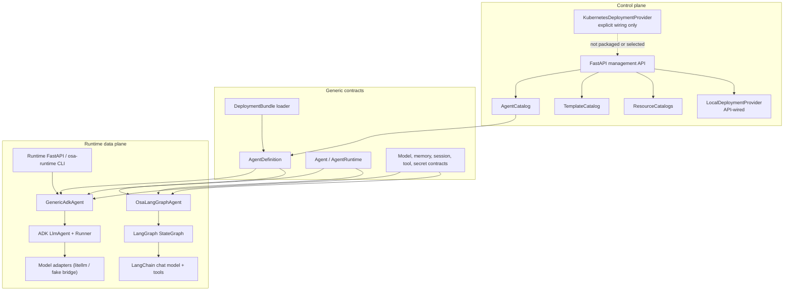
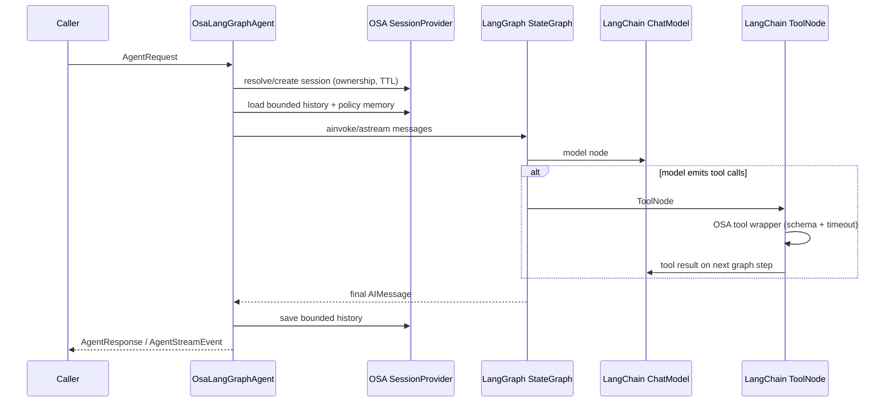
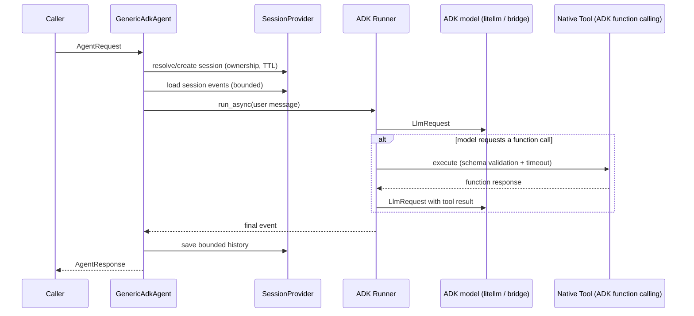

# Current Architecture

This document describes the source tree on `main`. It is an implementation
map, not a promise that planned capabilities exist.

## Workspace

OSA is a Python 3.12 uv workspace with four packages sharing the PEP 420
namespace `osa`:

| Package | Import root | Responsibility |
|---|---|---|
| `generic-agent` | `osa.generic_agent` | Domain model, configuration, deployment bundles, catalogs, provider contracts, errors |
| `runtimes/adk` | `osa.runtimes.adk` | ADK-specific construction, model adapters, MCP client/toolsets, memory persistence, session bridging, Runner invocation, runtime API, service CLI |
| `runtimes/langgraph` | `osa.runtimes.langgraph` | LangChain model/tool adapters, LangGraph `StateGraph` execution, OSA session/memory/policy bridge, programmatic bundle bootstrap |
| `control-plane/backend` | `osa.control_plane.backend` | Agent records/templates/resources (in-memory, local SQLite, or PostgreSQL repositories, ADR-004), local deployment provider, management API |

Namespace levels such as `src/osa/` intentionally have no `__init__.py`.

## Component map

## Agent construction

`AdkRuntime.create()` receives an already validated `AgentDefinition`. During
`GenericAdkAgent` construction it:

1. resolves every native tool definition and implementation (missing
   references fail fast);
2. resolves every skill definition (missing references fail fast);
3. resolves the model definition from the catalog — an unknown reference
   fails fast; an absent reference uses the catalog default, and with no
   default at all only an explicitly supplied deterministic provider may be
   used;
4. builds the ADK model through the adapter registry (`litellm` for live
   models, a `ModelProvider` bridge for deterministic tests);
5. builds an ADK `LlmAgent` with `OsaFunctionTool` wrappers whose
   declarations come from `ToolDefinition.capabilities`;
6. builds an ADK `Runner` wired to `OsaAdkSessionService`, which stores ADK
   events inside the OSA session provider.

`LangGraphRuntime.create()` uses the same `RuntimeDependencies` composition
object and resolves the same OSA catalogs and providers before construction.
It builds a LangChain chat model, wraps native OSA tools as `StructuredTool`
instances, and compiles a `StateGraph` with a model node and LangChain
`ToolNode`. The graph is internal runtime machinery; OSA does not expose a
workflow DSL. The default backend uses the OSA `SessionProvider` as its source
of truth and can accept an optional LangGraph checkpointer for bounded
experiments.

Both backends are independently constructible through `AgentRuntime` and
return the framework-neutral `Agent` contract. This is the current abstraction
boundary: generic contracts and policies do not import either framework.

## LangChain/LangGraph invocation flow

The LangGraph backend supports OSA native tools, skills metadata, session
ownership, memory context, runtime timeouts, iteration limits, and stable
streaming events. MCP references fail fast until a LangChain MCP adapter is
provided; A2A and the packaged FastAPI service remain ADK-only in this slice.

## Invocation flow

Invocation flows through the ADK `Runner`. Tools execute through ADK-native
function calling — the earlier `TOOL_CALL` text protocol is gone.
`runtime.timeout_seconds` cancels the run (`invocation_timeout`);
`runtime.max_iterations` caps function-call rounds
(`iteration_limit_exceeded`). Generation settings follow explicit precedence:
`ModelDefinition.runtime_settings`, overridden by `ModelRef.parameters`.

## MCP runtime

`osa.runtimes.adk.mcp_client` connects to MCP servers over stdio or Streamable
HTTP (legacy SSE is rejected) using the official `mcp` SDK (ADR-002).
Connections are lazy, pooled per runtime (agents sharing a server share one
connection), owned by a keeper task so anyio cancel scopes are entered and
exited in one task, and closed on runtime shutdown. Server-level and
agent-level tool filters intersect; tools are namespaced `<server>_<tool>`
with origin metadata preserved and are resolved by ADK per invocation through
`OsaMcpToolset`. `GenericAdkAgent` pre-flights every MCP connection before a
run — ADK resolves toolsets fail-open (a dead server silently loses its
tools), which OSA replaces with a deterministic `mcp_connection_failed`
failure. Retries, timeouts, TLS verification, response-size caps, and
credential resolution (never storing values) follow `McpDefinition`.

## Sessions and memory

The OSA `SessionProvider` is the single source of truth for sessions:
ownership (`agent_name`, `user_id`, `tenant_id`), TTL expiry, and bounded history
(`max_history_messages`). ADK maps its event payload through
`OsaAdkSessionService`; LangGraph translates the bounded history into
LangChain messages before each graph run.
Caller-supplied unknown IDs are rejected (`session_not_found`), identity
changes are access violations (`session_access_denied`), and IDs are
server-issued UUIDs. `OsaAdkSessionService` maps ADK session operations onto
the provider, so model context stays bounded by the OSA history limit. The
in-memory provider is single-replica; bundles opt into a durable provider
through `spec.session.persistence` and `OSA_SESSION_DATABASE_URL`. PostgreSQL
is the shared provider; file-backed SQLite is an explicit local-only option.

Memory context is loaded only when `spec.memory.enabled` is true and a
memory provider is configured. Search is a case-insensitive substring match;
writes occur only through `agent.remember()` (raw interactions are never
auto-persisted; `auto_extract` is reserved). The effective policy comes from
the memory policy catalog when `spec.memory.policy` is set (policy fields are
authoritative; a disabled policy disables memory) and limits — per-scope
`max_entries` eviction and `retention_days` purging — are enforced after
every write and before reads (ADR-003). Scope IDs derive from the invocation
context: `user` -> caller, `agent` -> agent name, `tenant` -> tenant
metadata, `application` -> deployment constant; entries never cross scope
IDs.

Persistence is externalized: `OSA_MEMORY_DATABASE_URL` selects
`PostgresMemoryProvider` (SQLAlchemy async over asyncpg) for shared state or
`SqliteMemoryProvider` (SQLAlchemy async over a file-backed SQLite database)
for local state. Its independent schema is versioned by
`osa-memory-migrate`; runtime startup validates the migration and never
creates tables. Without the DSN, memory is in-memory and single-process.

Persistence provider selection is explicit per subsystem. A configured
database DSN is authoritative: connectivity or migration failure prevents
readiness rather than downgrading to another provider. When no DSN is set,
only the subsystem's documented process-local default is used. The explicit
SQLite providers are file-backed, use separate schema versions, five-second
busy timeouts, WAL, and foreign keys, and are rejected for shared-replica or
durable-production requirements. `OSA_PERSISTENCE_POLICY=shared` enforces
that PostgreSQL-only posture for enabled stateful surfaces. Lower-level A2A
and rate-limit stores may use SQLite explicitly where their libraries support
it.

## HTTP applications

The Control Plane application stores state through the `AgentRepository`
and `ResourceDefinitionRepository` contracts (ADR-004): by default in-memory
(tests/development), file-backed SQLite for an explicit local single-process
installation, or PostgreSQL via `OSA_CONTROL_PLANE_DATABASE_URL`
(`create_control_plane_app()`). PG writes are transactional; agent names and
`(agent_id, version)` are unique constraints; updates compare-and-set on
`current_version`; transitions lock the row and validate the move. Persisted
resource definitions initially materialize into the catalogs at startup and
are refreshed on route, activation, and deployment reads. PostgreSQL schema is
managed by Alembic; SQLite uses a separate versioned `osa-cp-migrate` path.
Both are explicit ops steps — the app verifies connectivity/schema and never
migrates at startup, avoiding multi-replica races. Records and
version history survive restarts, and agent records/version history share state
across replicas. Resource records are durable, and route/activation/deployment
reads reconcile the process-local catalogs from them; PostgreSQL cross-replica
acceptance is covered by the CI integration suite.

Routes enforce create/transition validation, cumulative list filters with
pagination/sorting, immutable version snapshots, optimistic concurrency, and
the stable error envelope (`{"error": {"code", "message"}}`). Resource APIs
(P1.2) provide CRUD/list/search for models, tools, skills, MCPs, and memory
policies with tenant-scoped write-through persistence, reference-usage checks
before deletion (a resource used by an agent in the same tenant cannot be
deleted), credential redaction, and bundle import/export. Deployment provider
routes support the local development provider and the operator-selected
Kubernetes provider; Kind acceptance passes in CI, and the exposed
deployment-operation ownership contract is accepted. The remaining
distributed-ownership work is limited to the architecture-gated A2A streaming
and late-event contract in `TODO.md`.

The runtime application owns one module-level runtime and agent. The
production path is the `osa-runtime` CLI (or `create_runtime_app`), which
loads a deployment bundle during startup: bundle validation, reference
resolution, and secret resolution all complete before readiness, and an
invalid bundle aborts startup. SIGTERM runs the lifespan shutdown and closes
the runtime cleanly. The runtime image (`Dockerfile`) runs non-root with an
arbitrary-UID-friendly layout, a health check, and an externally mounted
bundle; CI builds it and runs a container smoke test (ready → invoke →
SIGTERM).

Both APIs install the shared authentication boundary from
`osa.generic_agent.auth`. Authentication is disabled by default for local
development; `optional` accepts anonymous requests but validates a supplied
Bearer token, and `required` protects every non-public endpoint. Health and
OpenAPI discovery paths remain public. The current implementation validates
RS256/384/512 and ES256/384/512 JWTs against an explicit JWKS URL or the
configured issuer's standard OIDC discovery `jwks_uri`, issuer, and audience,
enforces configured scopes, and returns the stable 401/403 error envelope.
Explicit JWKS configuration takes precedence; discovery metadata must match the
configured issuer. With `OSA_AUTH_ENFORCE_PERMISSIONS=true`, common `roles`/`role`
claims, Keycloak `realm_access.roles`, explicit `permissions`/`permission`
claims, and scopes are evaluated against stable route permissions. The
built-in roles are `administrator`/`admin` (wildcard), `operator` (all
permissions), `viewer` (read permissions), `agent`/`caller`/`user`
(`agent:invoke`), and `service` (`agent:invoke` plus `resource:read`).
On runtime invocation, an omitted `user_id` is derived from the validated token
subject and a supplied different value is rejected. A `tenant_id` or `tid`
claim is bound to invocation metadata: omitted metadata is filled from the
claim, a mismatch is rejected, and an unscoped token cannot spoof a tenant.
Control Plane managed agents now carry optional tenant ownership, assigned from
the authenticated claim and enforced across list/read/lifecycle routes; the
PostgreSQL schema uses migration 0003. Deployments inherit agent tenant
ownership and migration 0004 persists it. Resource definitions use isolated
tenant namespaces, allow equal names across tenants, and migration 0005 stores
the owner; activation and deployment bundle export resolve the matching
namespace. Successful management mutations and privileged external-agent
invocations append tenant-filtered, redaction-safe audit events; PostgreSQL
persists them with migration 0006. Definition-owned resource policy now gates
model, tool, MCP, and skill references before runtime construction and can
disable inbound A2A exposure. The shared OIDC/OAuth boundary validates JWTs or
RFC 7662 opaque tokens on both HTTP and inbound A2A JSON-RPC routes; protected
Agent Cards advertise the required `osa_oidc` scheme and validated subject and
tenant claims propagate into invocations.

## Deployment

`DeploymentProvider` separates process lifecycle from in-process agent
execution. `LocalDeploymentProvider` launches a server-owned command as a
subprocess, captures bounded logs per deployment, probes a health URL during
startup (early exit or a missed probe window fails the deployment with the
captured logs), detects dead processes on status, and can recognize idempotent
re-deploys of the same running command. The local provider is explicitly
development-only, and provider cleanup occurs when its shutdown path is called.

The Control Plane exposes deployment APIs (P1.5) through
`DeploymentService`: deploying an active agent exports its definition plus
referenced resources to a bundle directory and launches a runtime via a
server-owned command template (`OSA_DEPLOY_COMMAND_TEMPLATE`) — commands are
never accepted from API input. Intent and observed state persist through the
`DeploymentRecordRepository` (in-memory, or PostgreSQL when the Control
Plane uses a database); rollback relaunches an earlier immutable version
snapshot under the same ownership boundary as other mutations.
Durable Control Plane deployments select the Kubernetes provider. Deployed
runtimes are external processes: no ADK internals are imported. Kubernetes
status/list operations rehydrate workloads from OSA identity labels after a
Control Plane restart; real Kind validation passes in CI. Mutating deploy,
stop, restart, and rollback operations use a tenant/resource-scoped lease with
a stable operation ID and monotonically increasing fencing epoch. The
PostgreSQL ownership table is created only by migration 0010; a heartbeat
renews the lease, takeover occurs only after expiry, and fenced repository
writes reject late results. Status, logs, and provider reconciliation remain
read-only observation paths. Independent-worker PostgreSQL acceptance passes
in CI for provider-side-effect serialization, expiry/takeover, late-result
rejection, tenant isolation, and restart/reconciliation recovery.
The provider factory rejects `OSA_DEPLOY_PROVIDER=openshift` until a separate
OpenShift provider is implemented; OpenShift API and admission behavior must
not be added as conditional paths to the generic Kubernetes provider.

Deployment records expose an optional public runtime invoke URL synthesized
from `OSA_DEPLOY_INVOKE_URL_TEMPLATE` (ADR-008, migration 0007). The Control
Plane never proxies invocation traffic — the URL is informational routing
metadata. The deployment service forwards `OSA_DEPLOY_RUNTIME_ALLOWED_ORIGINS`
as `OSA_RUNTIME_ALLOWED_ORIGINS` to launched runtimes so browser clients can
call the runtime cross-origin (opt-in CORS middleware).

## A2A interoperability

The runtime exposes A2A-enabled agents (ADR-005, `a2a-sdk` 1.x): the Agent
Card is generated from the validated definition plus resolved skills and
served at the well-known path; when inbound authentication is protected, the
card advertises the same bearer/OIDC requirement enforced by the runtime;
`message/send` maps one A2A task per
invocation through `GenericAdkAgent.invoke`, with the A2A context id mapped
to an OSA session. The SDK task store is process-local by default; when
`OSA_A2A_TASK_DATABASE_URL` is set, OSA wires the SDK's SQLAlchemy
`DatabaseTaskStore` with tenant/subject ownership and initializes it before
readiness. A separate versioned OSA ownership table (`<task_table>_ownership`)
stores the tenant/caller scope, worker lease, fencing epoch, bound session, and
durable cancellation flag. Only the current lease holder invokes the agent;
healthy workers heartbeat, while retries may reclaim an expired lease or replay
a durable terminal task. Run `osa-a2a-migrate` before startup; runtime startup
only validates the task, ownership, and schema-version-2 event tables.
The bounded polling relay reads those events by tenant-scoped cursor, and
independent PostgreSQL workers are accepted for takeover fencing, late-event
rejection, ordered terminal delivery, and cursor replay. It is not attached to
a public route yet; PostgreSQL is the
shared-production choice; SQLite is an explicit local-only option where the
SDK supports it. The SDK active-task registry remains process-local. Its
durable task saves carry the ownership snapshot through the SDK call context
and execute while the ownership-row lock is held; an expired or superseded
worker therefore fails closed without publishing a synthetic failure. The
executor drains terminal events through the SDK consumer before releasing its
lease, so a terminal ownership state cannot race an unpersisted task event.
Remote handlers wait for durable cancellation, or safely finalize it after an
owner lease expires; terminal snapshots replay through read-only SDK events.
Process-boundary PostgreSQL acceptance covers shared task creation, lookup,
cancellation, and crash recovery. An expired-owner retry finalizes a
non-terminal task as failed and never replays unknown model/tool side effects.
The bounded relay verifies the full tenant-and-subject ownership scope before
each tenant-indexed cursor page read. Independent PostgreSQL-worker relay
takeover/late-event acceptance is covered; public multi-process streaming-route
acceptance remains open. The runtime drains the handler's active
tasks before closing agent and database dependencies. The Control Plane tracks **external** A2A agents as
records distinct from managed agents: registration fetches and validates the
remote Agent Card, refresh re-checks health, and invocation goes through the
A2A client with bounded timeouts and `a2a_remote_failed` error mapping. The
registry is durable when the PostgreSQL repository is configured; the
in-memory default remains process-local.
External records are structurally barred from deployment. Inbound A2A uses the
same authentication and route-permission middleware as `/v1/invoke`, including
subject/tenant propagation. Outbound remote-agent credentials use the shared
API-key, OAuth2, and mTLS adapters in `osa.generic_agent.credentials`.

## Observability

Both HTTP applications assign or preserve a validated `X-Request-ID`, emit
redaction-safe structured boundary events, and expose bounded Prometheus
counters and duration summaries at `/metrics`. Runtime invocation, A2A,
model, tool, MCP, memory, session, and deployment operations use the shared
observability helper. OpenTelemetry-compatible spans are emitted when an SDK
provider/exporter is configured; prompts, outputs, authorization headers,
tokens, secrets, and credentials are excluded from logs, metrics, and span
attributes.

HTTP rate limiting is an opt-in fixed-window contract keyed by method, route,
and hashed caller identity. It uses a bounded in-memory store by default. When
`OSA_RATE_LIMIT_DATABASE_URL` is configured, both HTTP applications use the
shared async SQLAlchemy store with atomic conflict updates and stale window
pruning; PostgreSQL is required for cross-replica production limits, while
SQLite is an explicit local-testing option. The schema is provisioned by
`osa-rate-limit-migrate`.

Capability telemetry has the same explicit hierarchy: the default is disabled,
the bounded JSONL sink is process-local, and
`OSA_CAPABILITY_TELEMETRY_DATABASE_URL` selects the shared PostgreSQL sink.
Its migration-owned schema records bounded tenant/operation metadata, stable
event IDs, producer sequence numbers, producer time, and database ingestion
time. Duplicate event IDs are ignored; readers order by ingestion time and ID;
the configured retention window prunes old rows and tenant deletion is
explicit. A configured sink is validated before readiness and never falls back
to a local sink after a database failure.

## Tests and CI

The local baseline is split between deterministic tests and optional
PostgreSQL/A2A/provider tests. The latter are skipped when their optional
dependencies or `OSA_TEST_DATABASE_URL` are unavailable; CI runs the complete
matrix and service-backed suites:

- `ruff format --check .`;
- `ruff check .`;
- strict `mypy .` across all first-party packages;
- `pytest --tb=short -q`;
- a container job: `uv lock --check`, `docker build`, then a smoke test that
  starts the built image with the `examples/smoke-bundle` configuration,
  waits for readiness, performs an invocation, and verifies a clean SIGTERM
  exit.

Tests use the fake provider, scripted ADK models, in-memory services, a
deterministic stdio MCP server subprocess, localhost Streamable HTTP and A2A
servers, and generated JWT/JWKS material — no external network. PostgreSQL
memory, Control Plane, and A2A task-store/ownership persistence tests run
against a real PostgreSQL 16 service in CI (`OSA_TEST_DATABASE_URL`) and skip
locally when unset.
Streaming tests cover the SSE contract, disconnect-triggered cancellation,
timeouts, concurrent load, and cross-replica session consistency over a
shared provider. Live-model acceptance is covered by an opt-in test that uses
the LiteLLM adapter and can run only when its repository secret is enabled;
there is no live-identity-provider or public multi-process A2A streaming-route
test yet. Durable relay takeover/late-event acceptance is covered by an
independent-worker PostgreSQL test. The Kind Kubernetes lifecycle and
independent-worker PostgreSQL
deployment-operation acceptance pass in CI. CI enforces an 84% coverage
threshold; live identity-provider acceptance and public A2A streaming-route
acceptance remain backlog work. The opt-in live-provider job is available when
its repository secret is configured, but it is intentionally skipped in offline
CI runs.

## Dependency risks

- `google-adk>=2.0,<3.0` pins the tested major line; ADK still emits its own
  `BaseAgentConfig` deprecation warning at import time (filtered in pytest,
  documented there).
- The MCP runtime supports `mcp>=1.24,<3`; the OSA bridge normalizes the
  supported 1.x/2.x timeout, field-name, HTTP-client, and fixture differences.
  CI runs the protocol and ADK Runner suites against `mcp==1.29.1` and
  `mcp==2.2.0`. Google ADK 2.8.0 still declares `<2` for its optional MCP
  extra, which OSA does not select because it owns the bridge.
- `litellm>=1.84` is optional (`osa-adk-runtime[litellm]`); configuring a
  litellm model without the extra fails fast (ADR-001).
- `langchain>=1.0,<2.0` and `langgraph>=1.0,<2.0` are isolated in
  `osa-langgraph-runtime`; provider integrations are optional under its
  `providers` extra, and the `litellm` extra bridges existing OSA LiteLLM
  model entries through LangChain. The backend currently uses the OSA session
  provider rather than claiming durable LangGraph checkpoint semantics by
  default.
- Package manifests share one lockstep release version, enforced by
  `tests/unit/test_versioning.py`; release automation publishes GitHub Release
  assets and signed/attested GHCR images, while the first public release and
  optional package-registry publication remain pending (P3.3).

## Architectural invariants

- Generic contracts do not import ADK or FastAPI.
- The Control Plane stores definitions, not running agents.
- Agent invocation does not pass through the Control Plane.
- MCP definitions remain distinct from native tool definitions.
- Session and memory remain separate.
- Deployment providers remain separate from `AgentRuntime`.
- Secret values never appear in definitions, responses, logs, or errors.
- The `fake` provider is a deterministic test adapter, never a production
  fallback.
- OSA remains independent from the Micro-Agents project unless a future ADR
  explicitly changes that position.
