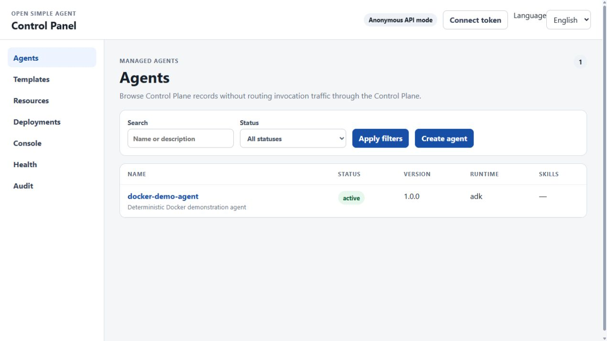
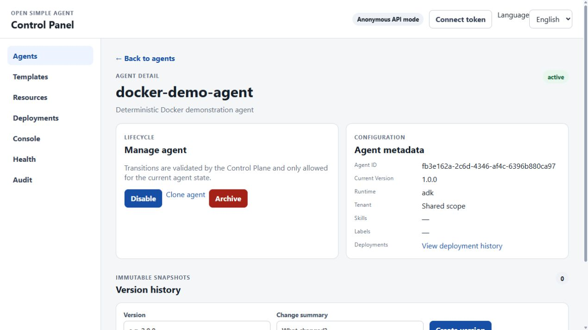
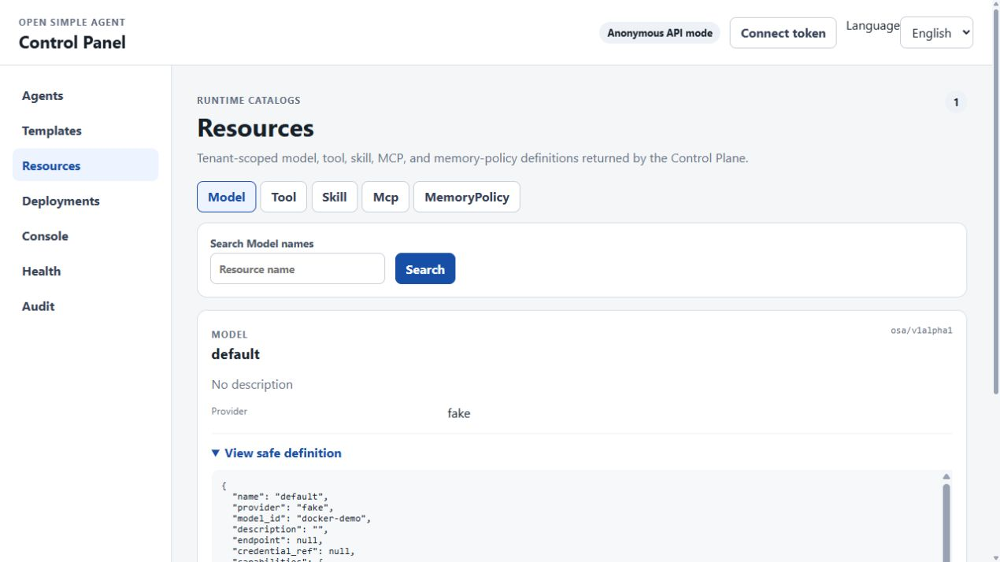
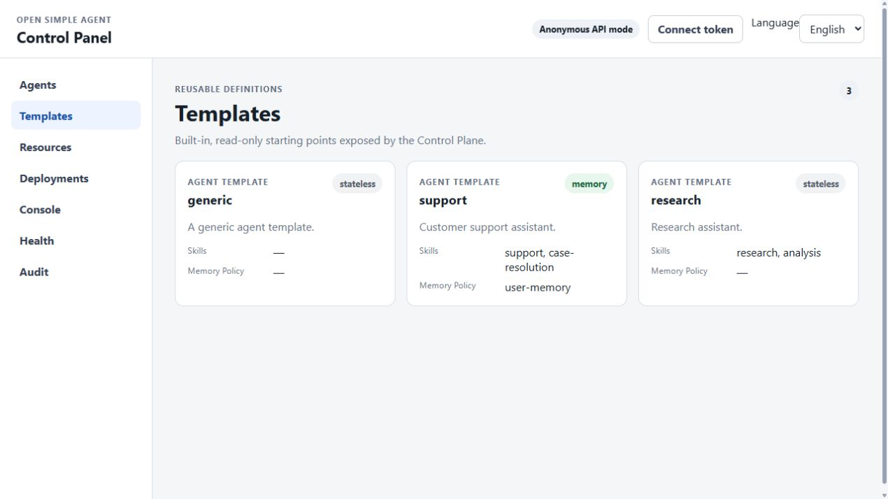
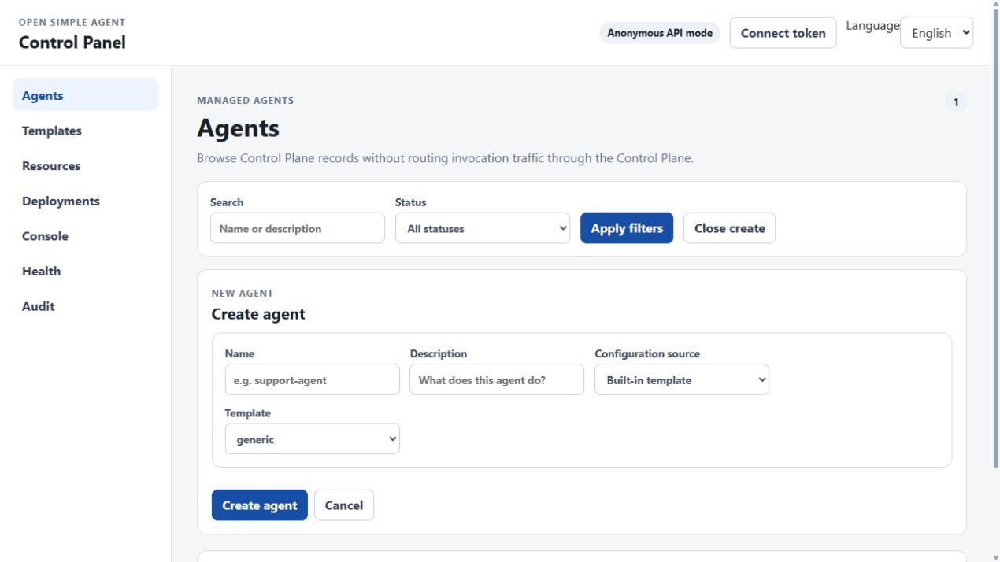
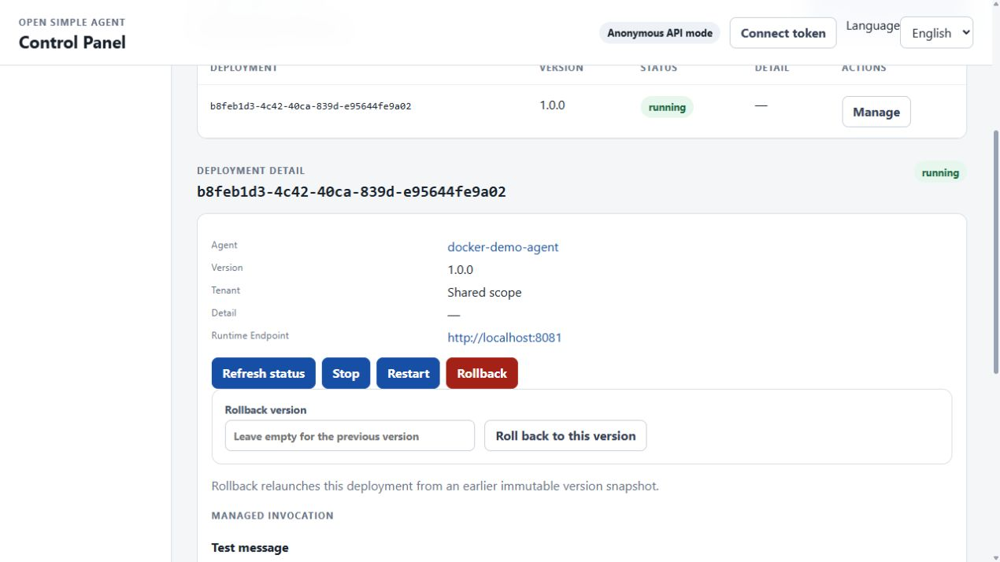
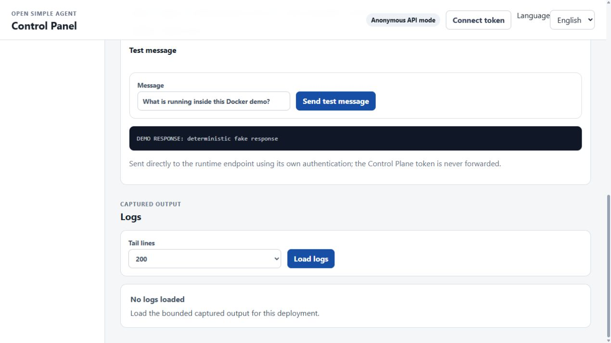
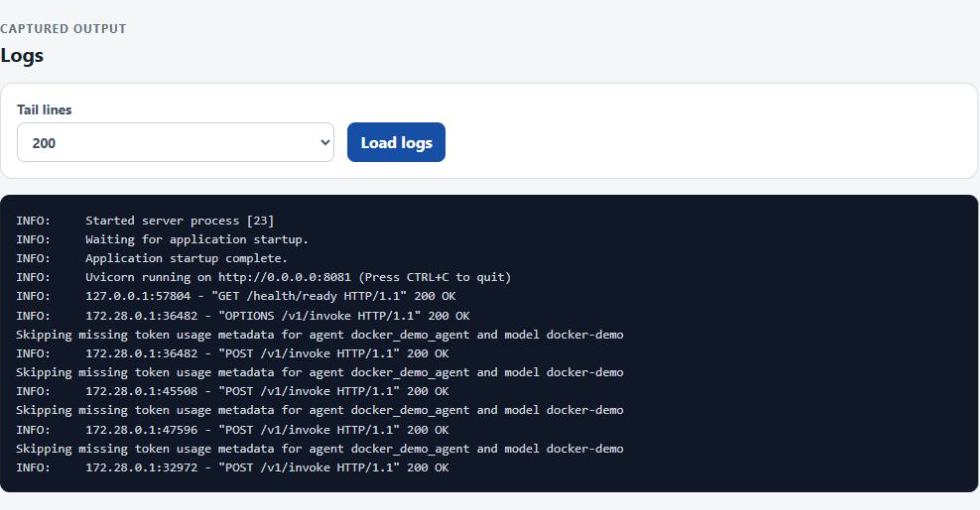
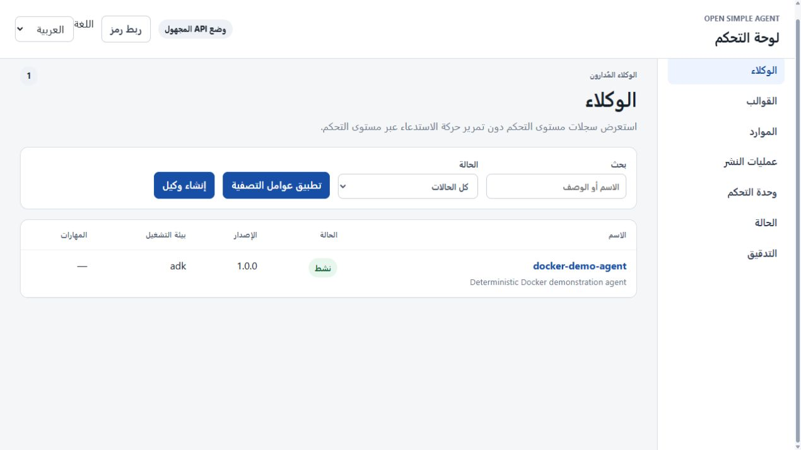
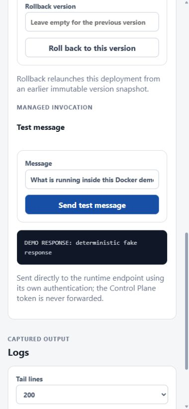

# Docker demo screenshot gallery

These are real captures from the [v0.1.5 Docker demo release](https://github.com/bassemZohdy/open-simple-agent/releases/tag/v0.1.5), using the synthetic `docker-demo-agent` and the explicitly enabled fake provider. The visible `DEMO RESPONSE` is deterministic, not live model output. See [capture metadata](metadata-v0.1.5.json) for the exact commit, image digests, environment, and viewport sizes.

## Agent and configuration

**1. Active sample agent.** [Walkthrough step 3](../../guides/docker-demo.md#3-seed-the-sample-agent) creates and activates `docker-demo-agent`.

**2. Agent details.** [Walkthrough step 4](../../guides/docker-demo.md#4-open-the-control-panel) shows the active version and deployment link.

**3. Model resource.** [Walkthrough step 4](../../guides/docker-demo.md#4-open-the-control-panel) shows the `default` resource with provider `fake`.

**4. Built-in templates.** [Walkthrough step 4](../../guides/docker-demo.md#4-open-the-control-panel) offers three starting templates.

**5. Create from a template.** [Walkthrough step 4](../../guides/docker-demo.md#4-open-the-control-panel) exposes the creation form; this capture does not submit a second agent.

## Deploy and invoke

**6. Running deployment.** [Walkthrough step 4](../../guides/docker-demo.md#4-open-the-control-panel) shows the running status and browser-reachable runtime endpoint.

**7. Successful invocation.** [Walkthrough step 5](../../guides/docker-demo.md#5-invoke-the-agent) sends the exact sample prompt and shows the labeled fake response.

**8. Captured runtime logs.** [Walkthrough step 6](../../guides/docker-demo.md#6-observe-status-and-logs) shows successful readiness and invoke requests.

## Layouts

**9. Arabic RTL.** [Walkthrough step 4](../../guides/docker-demo.md#4-open-the-control-panel) in Arabic with the same synthetic agent.

**10. Narrow screen.** [Walkthrough step 5](../../guides/docker-demo.md#5-invoke-the-agent) at a 390 × 844 viewport with the same successful response.

To refresh these images for a later release, follow the [capture script](../../guides/docker-demo-capture.md), replace the metadata sidecar, and check every image for tokens, credentials, personal data, and unrelated browser content. Keep raw recordings outside git.
